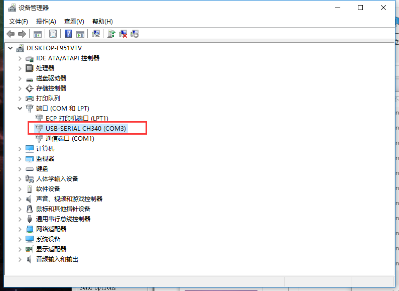

总操作流程：
- 1、驱动下载安装；
- 2、esp8266链接usb转串口
- 3、测试

----------
#驱动下载安装
将USB 转串口插到电脑上，下载安装驱动[CH341SER.EXE](https://pan.baidu.com/s/1bPLiDqTQ5e6CPCk1NYWfDQ)
`安装成功标志：`

#esp8266链接usb转串口

#测试
[参考文献](https://blog.csdn.net/jackhuang2015/article/details/45032571)
测试工具测试[USR-TCP232-Test.exe](https://pan.baidu.com/s/1NYXFJInH5SEbsExB9rbR1Q)

