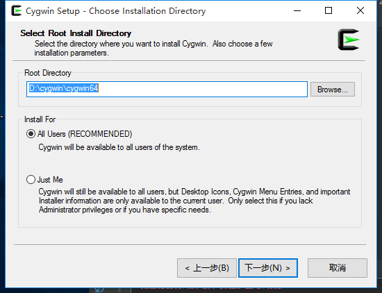
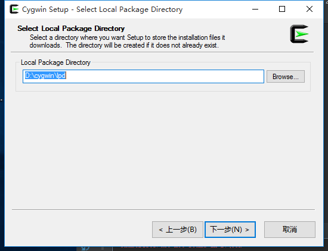
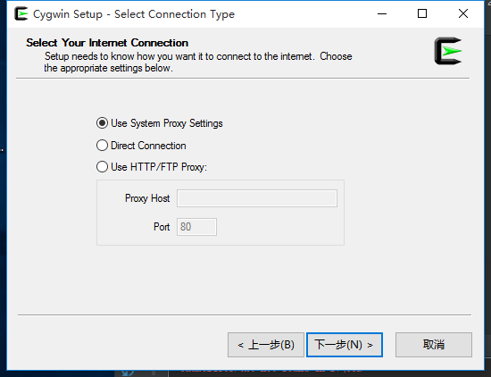
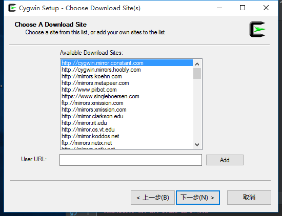
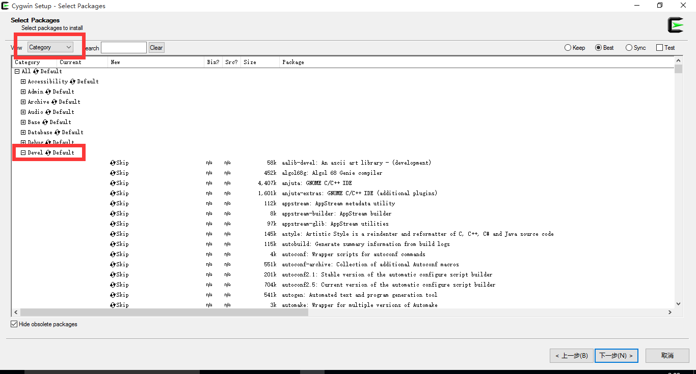
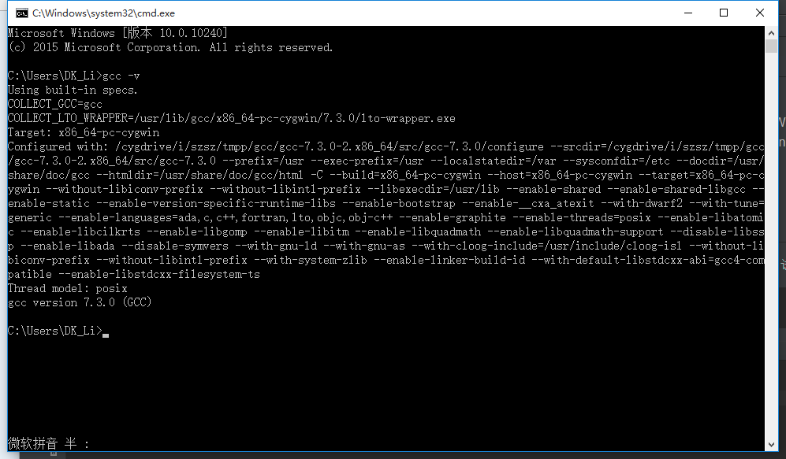

总操作流程:
- 1、下载安装；
- 2、配置；
- 3、测试；

----------
# 下载安装
### 1、下载
[下载地址](https://cygwin.com/install.html)
### 2、安装












下载这些包：
```
gcc-core、gcc-g++、make、gdb、binutils，cmake
```
# 配置
变量名：CYGWIN_HOME
变量值：D:\cygwin\cygwin64

path添加：;%CYGWIN_HOME%\bin;%CYGWIN_HOME%\opt\xtensa-lx106-elf\bin;%CYGWIN_HOME%\opt\xtensa-esp108-elf\bin

# 测试
cmd命令下测试
```
gcc -v
```
