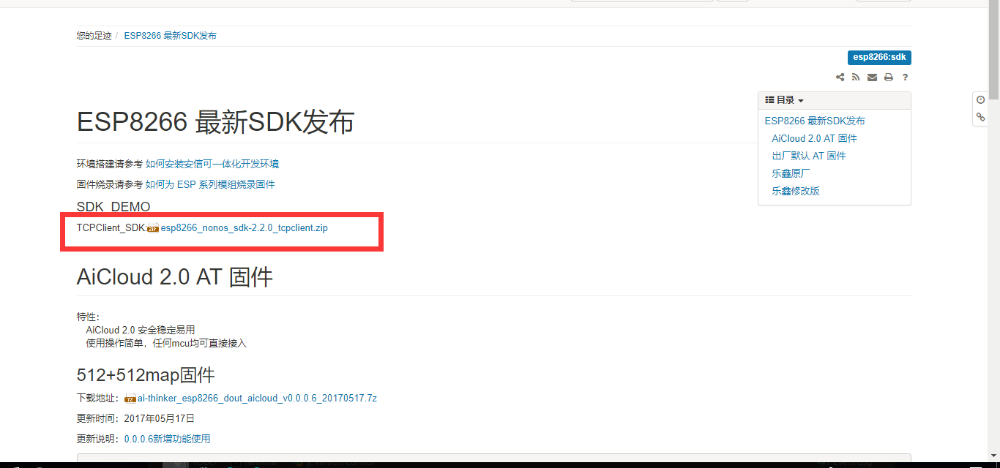
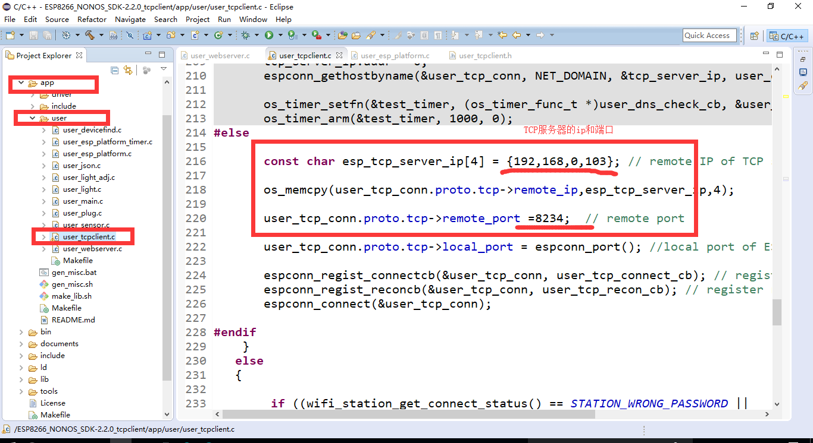
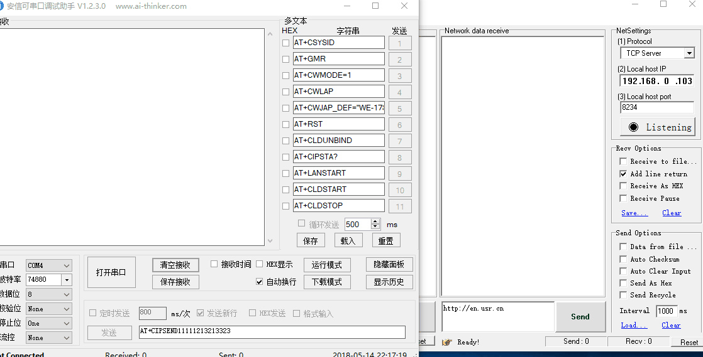

`注意：此教程不能发送信息到服务器，只能接收来自服务器的数据`
总操作流程：
- 1、下载固件；
- 2、修改文件；
- 3、烧写测试

***
# 下载固件
[官网下载](http://wiki.ai-thinker.com/esp8266/sdk)
[百度云](https://pan.baidu.com/s/14-dBFkHdL4dD7zroFm6BjQ)

# 修改文件
- user_tcpclient.h
修改成路由WiFi和密码，作用：加入到路由器

- user_tcpclient.c
修改成要链接的TCP服务器

# 烧写测试
我的WiFi模块是：esp8266-01

- 烧写

- 测试

