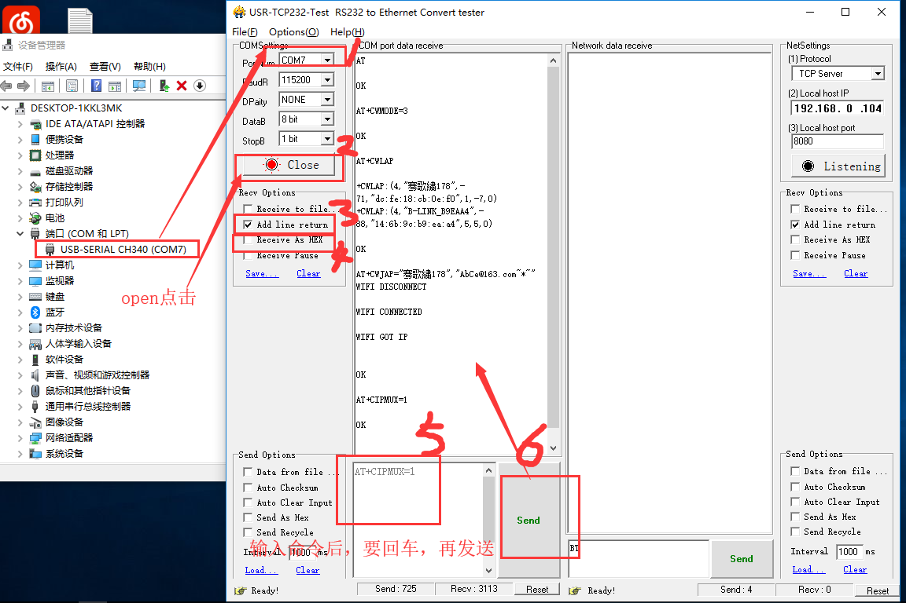
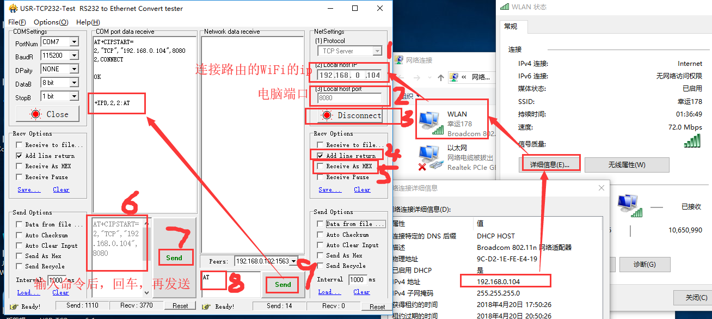

[参考文献](https://jingyan.baidu.com/article/c45ad29c346837051753e2e6.html)

总操作流程：
- 1、串口设置:输入命令；
- 2、pc链接路由wifi,网络设置：配置ip，端口；
- 3、测试

[AT命令资料](https://pan.baidu.com/s/1UoqsaGi03-MwDrXYDGtjAQ)

***
WiFi模块作为TCP客户端


# 串口设置:输入命令

```
AT  #测试是否链接成功，成功返回OK

AT+CWMODE=1  #设置WiFi应用模式为AP+station 共存模式

AT+RST #重启

AT+CWJAP_DEF="WE-178","AbCe@163.com~*~" #加入路由的WiFi

```
# pc链接路由wifi,网络设置：配置ip，端口
```
AT+CIPMUX=0 #启动单连接

AT+CIPSTART="TCP","192.168.0.103",8080 #连接服务器

AT+CIPMODE=1 #设置透传

AT+CIPSEND #启动发送

```


`退出透传模式：在串口那里输入+++，不用加回车`


