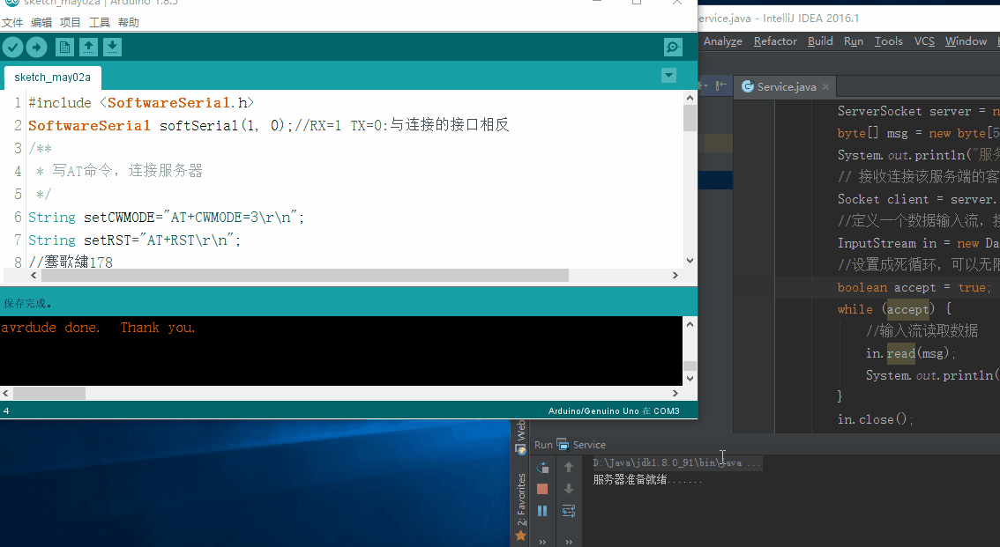

总操做流程：
- 1、各器件链接;
- 2、用Java写服务器程序;
- 3、arduino写程序;
- 4、测试;

----------

# 各器件链接;

# 用Java写服务器程序
```
import java.io.DataInputStream;
import java.io.InputStream;
import java.net.ServerSocket;
import java.net.Socket;

/**
 * Created by DK_Li on 2018/5/1.
 */
public class Service {

    public static void main(String[] args) throws Exception {
        // 创建服务端，指定端口为10012
        ServerSocket server = new ServerSocket(10012);
        byte[] msg = new byte[50];
        System.out.println("服务器准备就绪.......");
        // 接收连接该服务端的客户端对象
        Socket client = server.accept();
        //定义一个数据输入流，接收8266发送过来的消息
        InputStream in = new DataInputStream(client.getInputStream());
        //设置成死循环，可以无限接收8266发送的数据
        boolean accept = true;
        while (accept) {
            //输入流读取数据
            in.read(msg);
            System.out.println(new String(msg));
        }
        in.close();
        client.close();
        server.close();
    }

}
```
运行：


# arduino写程序
```
#include <SoftwareSerial.h>  
SoftwareSerial softSerial(1, 0);//RX=10 TX=11 
/**
 * 写AT命令，连接服务器
 */
String setCWMODE="AT+CWMODE=3\r\n";
String setRST="AT+RST\r\n";
//骞歌繍178
String setCWJAP="AT+CWJAP=\"幸运178\",\"AbCe@163.com~*~\"\r\n";
String setCIPMUX="AT+CIPMUX=1\r\n";
String setCIPSERVER="AT+CIPSERVER=1\r\n";
String setCIPSTART="AT+CIPSTART=0,\"TCP\",\"192.168.0.103\",10012\r\n";//这个端口就不能给你们看了  
String setCIPSEND="AT+CIPSEND=0,8\r\n";
String setString=" LayneYao\r\n";

void setAT(){
  delay(3000);  
  softSerial.print(setCWMODE);//将8266设置为STA模式 
  delay(3000);  
  softSerial.print(setRST);//设置完之后重启
  delay(3000);  
  softSerial.print(setCWJAP);//8266连接路由器发出的WiFi
  delay(3000);  
  softSerial.print(setCIPMUX);//启动多连接
  delay(3000);  
  softSerial.print(setCIPSERVER);//建立server
  delay(3000);  
  softSerial.print(setCIPSTART);//通过协议、IP和端口连接服务器
  delay(3000);  
  softSerial.print(setCIPSEND);//发送数据的长度
  delay(3000);  
  softSerial.print(setString);//发送数据
 }
 
void setup() {
  softSerial.begin(115200);
  setAT();
}

void loop() {

}
```
# 测试

