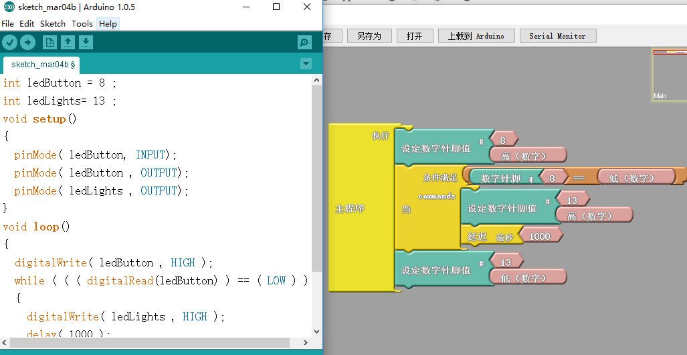
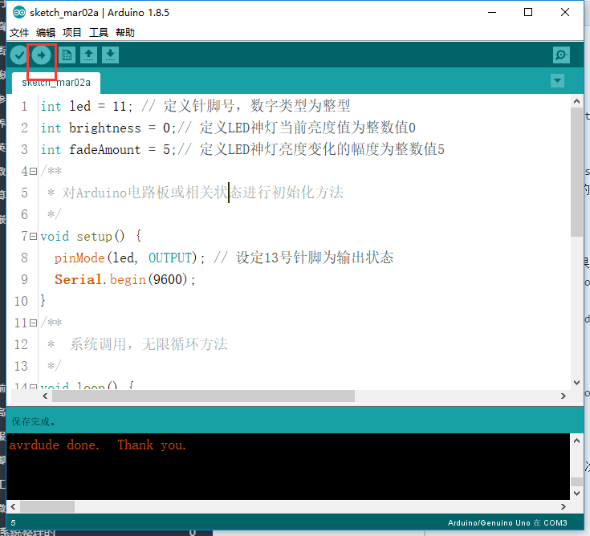

总操流程：
- 1、各器件链接
- 2、写入程序
- 3、测试

----------
# 各器件链接

# 写程序
```
int ledButton = 8 ;
int ledLights= 13 ;
void setup()
{
  pinMode( ledButton, INPUT);
  pinMode( ledButton , OUTPUT);
  pinMode( ledLights , OUTPUT);
}

void loop()
{
  digitalWrite( ledButton , HIGH );
  while ( ( ( digitalRead(ledButton) ) == ( LOW ) ) )
  {
    digitalWrite( ledLights , HIGH );
    delay( 1000 );
  }
  digitalWrite( ledLights , LOW );
}
```
### 另外一种方式（ardublock图形编程）

# 测试
