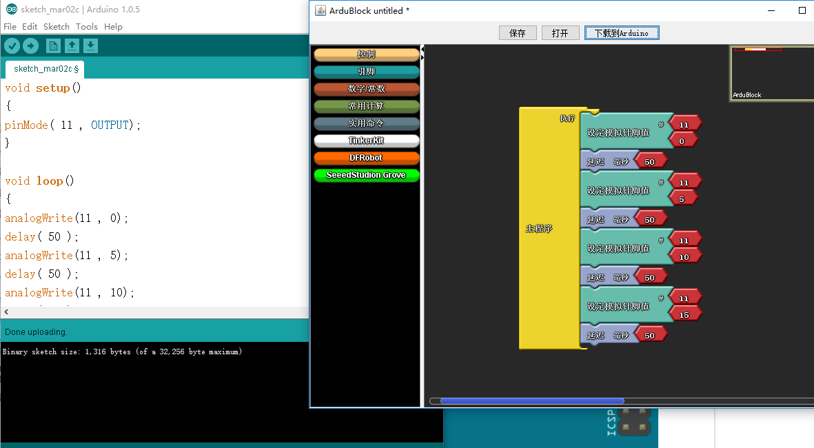

[参考资料](http://www.51hei.com/bbs/dpj-41338-1.html)
总操流程：
- 1、各器件链接
- 2、写入程序
- 3、测试

----------
# 各器件链接

# 写入程序
```
int led = 11; // 定义针脚号，数字类型为整型
int brightness = 0;// 定义LED神灯当前亮度值为整数值0
int fadeAmount = 5;// 定义LED神灯亮度变化的幅度为整数值5
/**
 * 对Arduino电路板或相关状态进行初始化方法
 */
void setup() {
  pinMode(led, OUTPUT); // 设定11号针脚为输出状态
}
/**
 *  系统调用，无限循环方法
 */
void loop() {
    analogWrite(led, brightness);// 设置LED神灯的当前亮度

    brightness = brightness + fadeAmount;// 计算LED神灯的此次循环的亮度数值，每次循环累加5（fadeAmount定义的数值）。

    /**
     * 此判断语句实现的效果是，判断LED神灯的当前亮度，当LED神灯全亮，将fadeAmount数值变为负数，达到降低LED神灯亮度的效果。
     * 当LED神灯熄灭，将fadeAmount数值变为正数，达到增加LED神灯亮度的效果。
     */
    if (brightness == 0 || brightness == 255) {
      fadeAmount = -fadeAmount ;
    }

    delay(50); // 每次循环结束，进入下一次循环之前，延时30毫秒执行
}
```
### 另外一种方式（ardublock图形编程）

# 测试
