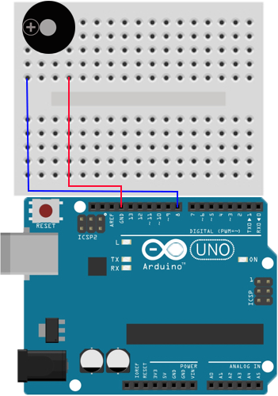

总操流程：
- 1、各器件链接
- 2、写入程序
- 3、测试

----------
# 各器件链接

# 写程序
```
int led = 8;
void setup()
{
}

void loop()
{
  tone(led, 1000);
  delay( 1000 );
  noTone(led);
  delay( 1000 );
}
```
另外一种方式（ardublock图形编程）

# 测试
