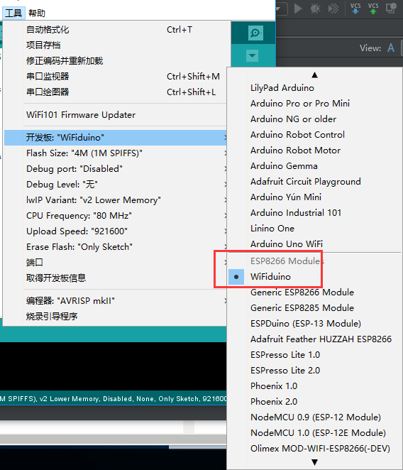
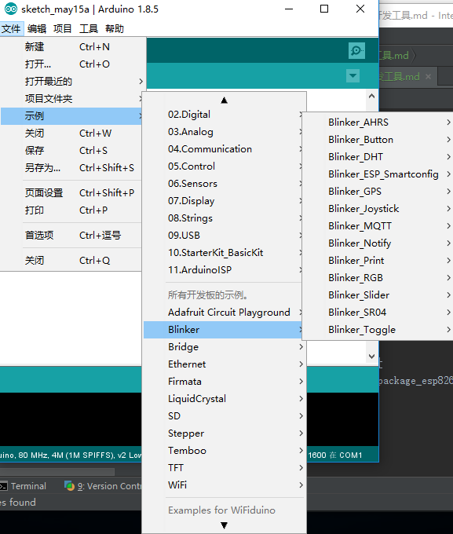

[参考文献]()
总操作流程：
- 1、下载安装arduino ide；
- 2、下载安装arduino安装包；
- 3、下载解压blinker库；

***
# 下载安装arduino ide
[官网下载](https://www.arduino.cc/)

# 下载安装arduino安装包
下载时路径不要改，这是对应arduino ide中的路径
[下载](https://pan.baidu.com/s/1BtBVqKXy45XoW6loNiBxgw)
`成功标识：`

# 下载解压blinker库
[下载](https://pan.baidu.com/s/1WmfZTtG0pKzbadbxFlDLBA)
解压到arduino库里
`成功标识：`

