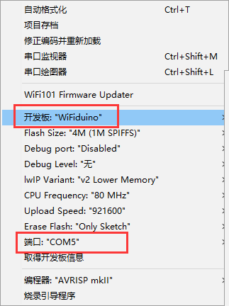
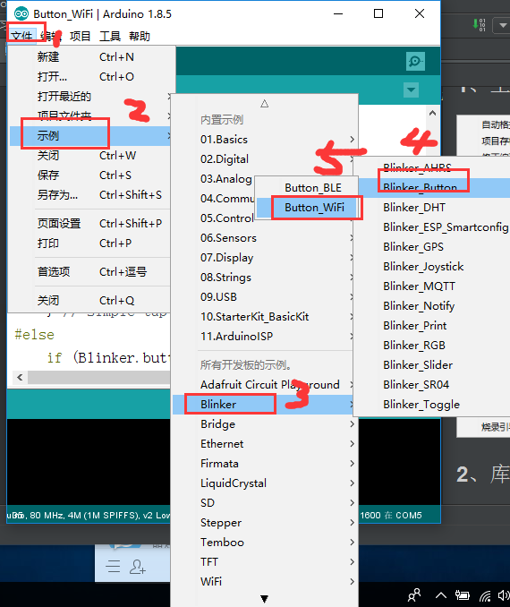
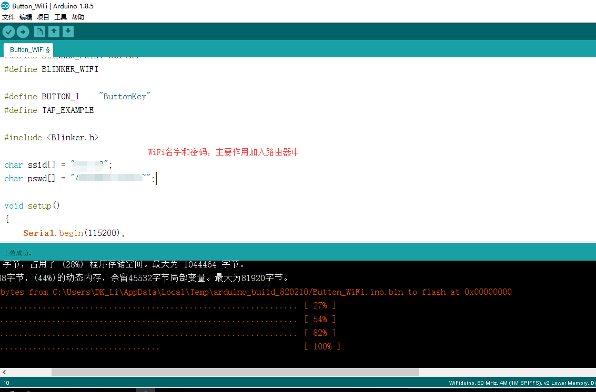
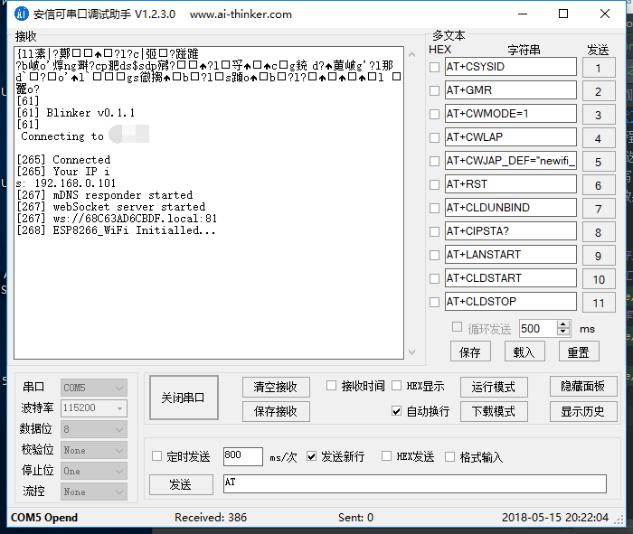

[参考文献](https://blinker-iot.com/?file=001-%E5%BF%AB%E9%80%9F%E5%BC%80%E5%A7%8B/02-esp8266WiFi%E6%8E%A5%E5%85%A5)
操作总流程：
- 1、ide选好选项；
- 2、烧写；
- 3、看效果；

***
# ide选好选项
### 1、工具项

### 2、库中文件

# 烧写

# 看效果
