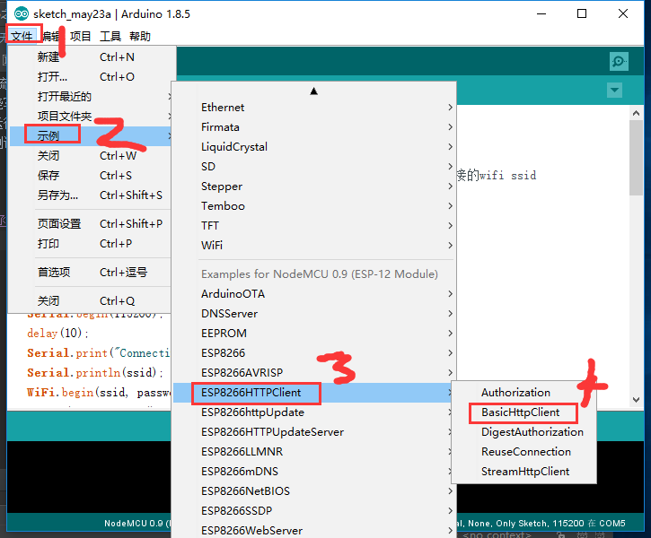
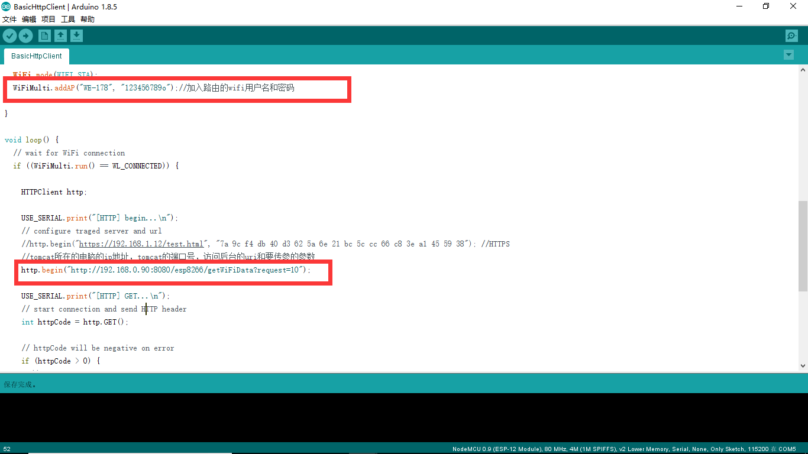
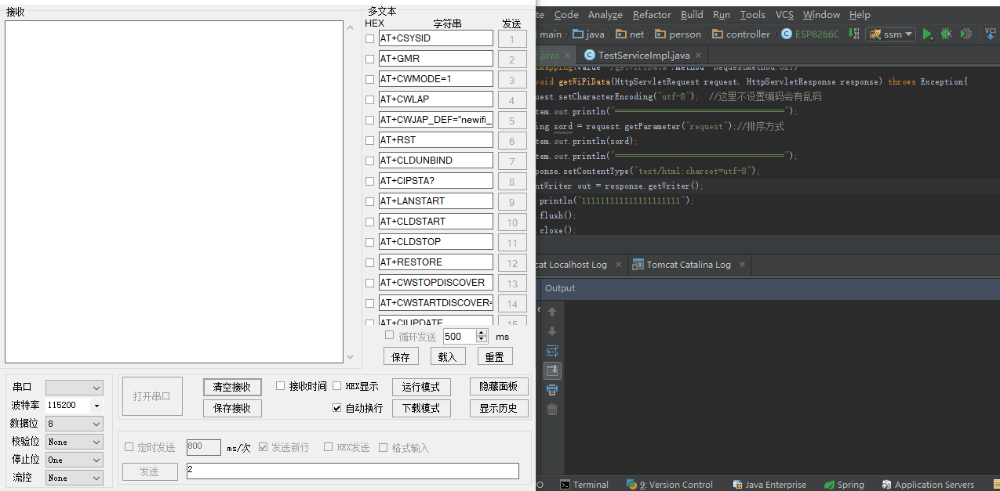

总操作流程:
- 1、烧写函数库的程序；
- 2、运行Javaweb程序；
- 3、测试；

***

# 烧写函数库的程序


`修改文件`




# 运行Javaweb程序

[](https://github.com/lidekai/esp8266_javaweb.git)


```
@Controller
@RequestMapping("/esp8266")
public class ESP8266Controller {
    @RequestMapping(value="/getWiFiData",method= RequestMethod.GET)
    public void getWiFiData(HttpServletRequest request, HttpServletResponse response) throws Exception{
        request.setCharacterEncoding("utf-8");  //这里不设置编码会有乱码
        System.out.println("====================================");
        String sord = request.getParameter("request");//排序方式
        System.out.println(sord);
        System.out.println("====================================");
        response.setContentType("text/html;charset=utf-8");
        PrintWriter out = response.getWriter();
        out.println("111111111111111111111");
        out.flush();
        out.close();
    }
}

```


# 测试

