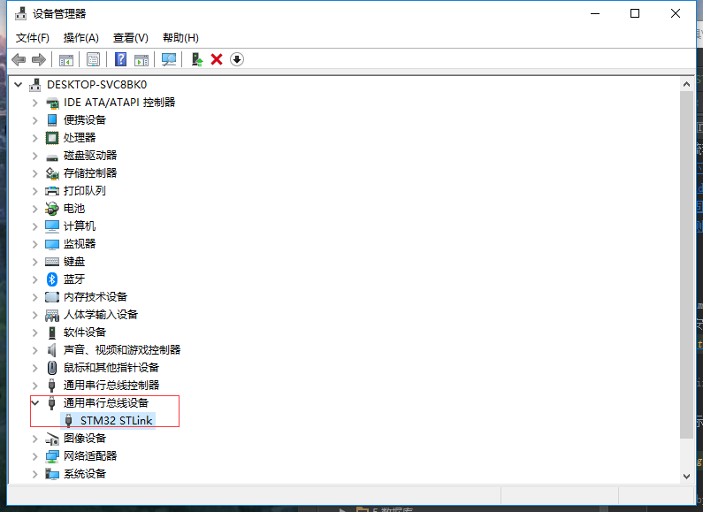
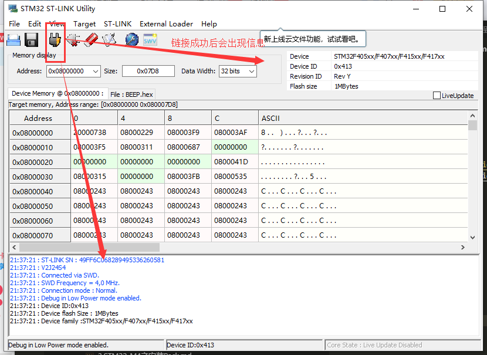
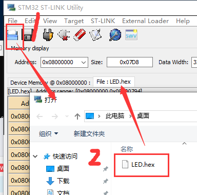
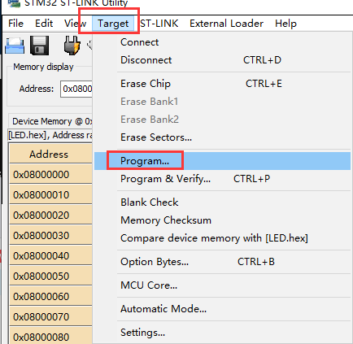
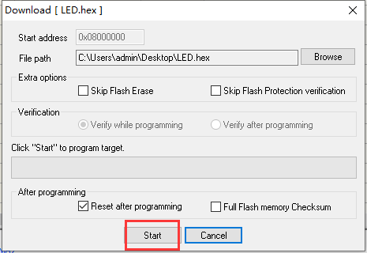

总操作流程：
- 1、[下载安装](#STM-M4-01)
- 2、[链接烧写](#STM-M4-02)
- 3、[看效果](#STM-M4-03)

*** 

# <a name="STM-M4-01" href="#" >下载安装</a>

# <a name="STM-M4-02" href="#" >链接烧写</a>

> 1、硬件连接

>2、通过usb连接电脑

# <a name="STM-M4-02" href="#" >链接烧写</a>

> 将usb接口连接到usb_slave上，开启开关可以看到效果
