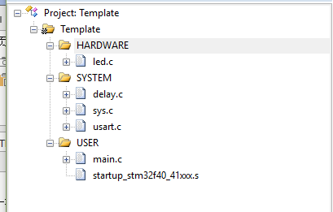
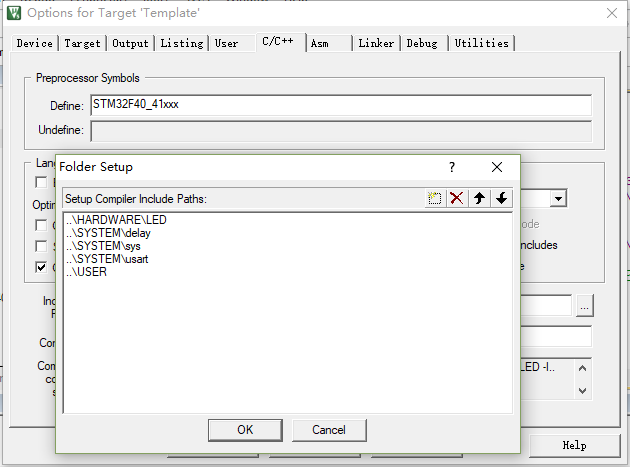
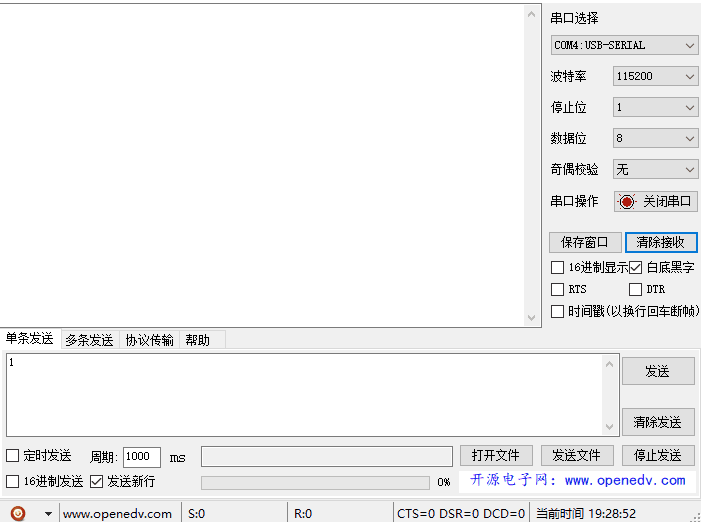

总操作流程：
- 1、[下载模板](#STM-M4-01)
- 2、[创建修改文件和配置环境](#STM-M4-02)
    - 2.[1、修改文件](#STM-M4-02-01)
    - 2.[2、配置环境](#STM-M4-02-02)
- 3、[看效果](#STM-M4-03)

***

# <a name="STM-M4-01" href="#" >下载模板</a>

[](https://github.com/lidekai/Template-RegisterLibrary.git)

# <a name="STM-M4-02" href="#" >创建修改文件和配置环境</a>

### <a name="STM-M4-02-01" href="#" >1、修改文件</a>

- 修改main.c文件内容

```c
#include "sys.h"
#include "delay.h"
#include "usart.h"
#include "led.h"
int main(void)
{
    u8 t;
    u8 len;
    u16 times=0;
    Stm32_Clock_Init(336,8,2,7);//设置时钟,168Mhz
    delay_init(168); //延时初始化
    uart_init(84,115200); //串口初始化为 115200
    LED_Init(); //初始化与 LED 连接的硬件接口
    while(1)
    {
        if(USART_RX_STA&0x8000)
        {
            len=USART_RX_STA&0x3fff;//得到此次接收到的数据长度
            printf("\r\n 您发送的消息为:\r\n");
            for(t=0;t<len;t++)
            {
                USART1->DR=USART_RX_BUF[t];
                while((USART1->SR&0X40)==0);//等待发送结束
            }
            printf("\r\n\r\n");//插入换行
            USART_RX_STA=0;
        }else
            {
                times++;
                if(times%5000==0)
                {
                    printf("\r\nALIENTEK 探索者 STM32F407 开发板 串口实验\r\n");
                    printf("正点原子@ALIENTEK\r\n\r\n\r\n");
                }
                if(times%200==0)
                    printf("请输入数据,以回车键结束\r\n");
                if(times%30==0)
                    LED0=!LED0;//闪烁 LED,提示系统正在运行.
                delay_ms(10);
        }
    }
}


```

### <a name="STM-M4-02-02" href="#" >2、配置环境</a>

- 导入文件



- 设置文件路径

`STM32F40_41xxx`



# <a name="STM-M4-03" href="#" >看效果</a>

> 注意：写代码的时候“波特率”可以写115200或者76800
>       烧写程序一定要选76800
>       串口助手一定要选115200

- 下载程序


- 看效果


