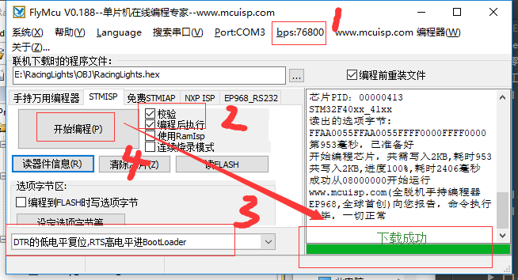

总操作流程：
- 1、[下载模板](#STM-M4-01)
- 2、[创建修改文件和配置环境](#STM-M4-02)
    - 2.[1、创建修改文件夹和文件](#STM-M4-02-01)
    - 2.[2、配置环境](#STM-M4-02-02)
- 3、[看效果](#STM-M4-03)

***

# <a name="STM-M4-01" href="#" >下载模板</a>

[](https://github.com/lidekai/Template-RegisterLibrary.git)

# <a name="STM-M4-02" href="#" >创建修改文件和配置环境</a>

### <a name="STM-M4-02-01" href="#" >1、创建修改文件夹和文件</a>
- 将根目录名改成：Template
- 创建OBJ文件夹
- 创建HARDWARE文件夹，且其下也创建KEY文件夹
- 在KEY文件夹下创建key.c和key.h文件
- key.h
```c
#ifndef __KEY_H
#define __KEY_H
#include "sys.h"
#define KEY0 PEin(4) //PE4
#define KEY1 PEin(3) //PE3
#define KEY2 PEin(2) //P32
#define WK_UP PAin(0) //PA0

#define KEY0_PRES 1 //KEY0 按下
#define KEY1_PRES 2 //KEY1 按下
#define KEY2_PRES 3 //KEY2 按下
#define WKUP_PRES 4 //KEY_UP 按下(即 WK_UP)

    void KEY_Init(void); //IO 初始化
    u8 KEY_Scan(u8); //按键扫描函数

#endif

```

- key.c

```c
#include "key.h"
#include "delay.h"
//按键初始化函数
void KEY_Init(void)
{
    RCC->AHB1ENR|=1<<0; //使能 PORTA 时钟
    RCC->AHB1ENR|=1<<4; //使能 PORTE 时钟
    GPIO_Set(GPIOE,PIN2|PIN3|PIN4,GPIO_MODE_IN,0,0,GPIO_PUPD_PU);
    //PE2~4 设置上拉输入
    GPIO_Set(GPIOA,PIN0,GPIO_MODE_IN,0,0,GPIO_PUPD_PD);
    //PA0 设置为下拉输入
}
//按键处理函数
//返回按键值
//mode:0,不支持连续按;1,支持连续按;
//0，没有任何按键按下
//1， KEY0 按下
//2， KEY1 按下
//3， KEY2 按下
//4， KEY_UP 按下 即 WK_UP
//注意此函数有响应优先级,KEY0>KEY1>KEY2>KEY_UP!!
u8 KEY_Scan(u8 mode)
{
    static u8 key_up=1; //按键按松开标志
    if(mode)key_up=1; //支持连按
    if(key_up&&(KEY0==0||KEY1==0||KEY2==0||WK_UP==1))
    {
        delay_ms(10);//去抖动
        key_up=0;
        if(KEY0==0)return 1;
        else if(KEY1==0)return 2;
        else if(KEY2==0)return 3;
        else if(WK_UP==1)return 4;
    }else if(KEY0==1&&KEY1==1&&KEY2==1&&WK_UP==0)key_up=1;
    return 0;// 无按键按下
}

```

- 修改main.c文件内容

```c

#include "sys.h"
#include "delay.h"
#include "led.h"
#include "beep.h"
#include "key.h"
int main(void)
{
    u8 key;
    Stm32_Clock_Init(336,8,2,7);//设置时钟,168Mhz
    delay_init(168); //延时初始化
    LED_Init(); //初始化与 LED 连接的硬件接口
    BEEP_Init(); //初始化蜂鸣器 IO
    KEY_Init(); //初始化与按键连接的硬件接口
    LED0=0; //先点亮红灯
    while(1)
    {
        key=KEY_Scan(0); //得到键值
        if(key)
        {
            switch(key)
                {
                case WKUP_PRES://控制蜂鸣器
                    BEEP=!BEEP;
                    break;
                case KEY2_PRES: //控制 LED0 翻转
                    LED0=!LED0;
                    break;
                case KEY1_PRES: //控制 LED1 翻转
                    LED1=!LED1;
                    break;
                case KEY0_PRES: //同时控制 LED0,LED1 翻转
                    LED0=!LED0;
                    LED1=!LED1;
                    break;
                }
        }
        else delay_ms(10);
    }
}

```

### <a name="STM-M4-02-02" href="#" >2、配置环境</a>
- 导入文件


- 设置文件路径

`STM32F40_41xxx`


# <a name="STM-M4-03" href="#" >看效果</a>

- 下载程序


- 看效果

`按五颗按钮有不同的反应`