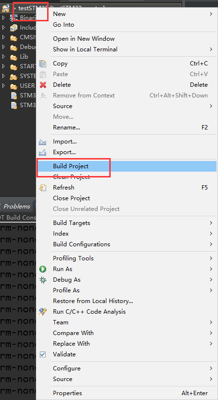

总操作流程：
- 1、[创建文件](#STM-M4-01)
- 2、[测试](#STM-M4-02)

***

# <a name="STM-M4-01" href="#" >创建文件</a>

>1、Module文件夹创建iwdg.c和iwdg.h文件

- iwdg.h
```c
#ifndef _IWDG_H
#define _IWDG_H
#include "sys.h"

void IWDG_Init(u8 prer,u16 rlr);//IWDG初始化
void IWDG_Feed(void);  //喂狗函数
#endif

```

- iwdg.c

```c
#include "iwdg.h"
void IWDG_Init(u8 prer,u16 rlr)
{
	IWDG_WriteAccessCmd(IWDG_WriteAccess_Enable); //使能对IWDG->PR IWDG->RLR的写
	
	IWDG_SetPrescaler(prer); //设置IWDG分频系数

	IWDG_SetReload(rlr);   //设置IWDG装载值

	IWDG_ReloadCounter(); //reload
	
	IWDG_Enable();       //使能看门狗
}

//喂独立看门狗
void IWDG_Feed(void)
{
	IWDG_ReloadCounter();//reload
}

```

>2、修改main.c文件

```c
#include "sys.h"
#include "delay.h"
#include "usart.h"
#include "led.h"
#include "beep.h"
#include "key.h"
#include "exti.h"
#include "iwdg.h"

    int _fstat (int fd, struct stat *pStat)
    {

        return 0;
    }

    int _close()
    {
        return -1;
    }

    int _write (int fd, char *pBuffer, int size)
    {
        for (int i = 0; i < size; i++)
        {
            while (!(USART1->SR & USART_SR_TXE))
            {
            }
            USART_SendData(USART1, pBuffer[i]);
        }
        return size;
    }

    int _isatty (int fd)
    {
        return 1;
    }

    int _lseek()
    {
        return -1;
    }

    int _read (int fd, char *pBuffer, int size)
    {
        for (int i = 0; i < size; i++)
        {
            while ((USART1->SR & USART_SR_RXNE) == 0)
            {
            }

            pBuffer[i] = USART_ReceiveData(USART1);
        }
        return size;
    }

    caddr_t _sbrk(int increment)
    {
        extern char end asm("end");
        register char *pStack asm("sp");

        static char *s_pHeapEnd;

        if (!s_pHeapEnd)
            s_pHeapEnd = &end;

        if (s_pHeapEnd + increment > pStack)
            return (caddr_t)-1;

        char *pOldHeapEnd = s_pHeapEnd;
        s_pHeapEnd += increment;
        return (caddr_t)pOldHeapEnd;
    }

    int main(void)
    {
    	NVIC_PriorityGroupConfig(NVIC_PriorityGroup_2);//设置系统中断优先级分组2
    	delay_init(168);  //初始化延时函数
    	LED_Init();				//初始化LED端口
    	KEY_Init();		  	//初始化按键
        delay_ms(100);    //延时100ms
    	IWDG_Init(4,500); //与分频数为64,重载值为500,溢出时间为1s
    	LED0=0;					  //先点亮红灯
    	while(1)
    	{
    		if(KEY_Scan(0)==WKUP_PRES)//如果WK_UP按下,则喂狗
    		{
    			IWDG_Feed();//喂狗
    		}
    		delay_ms(10);
    	};

    }
```


# <a name="STM-M4-02" href="#" >测试</a>




>一直不停地按：KEY_UP键，闪的红灯就不再闪