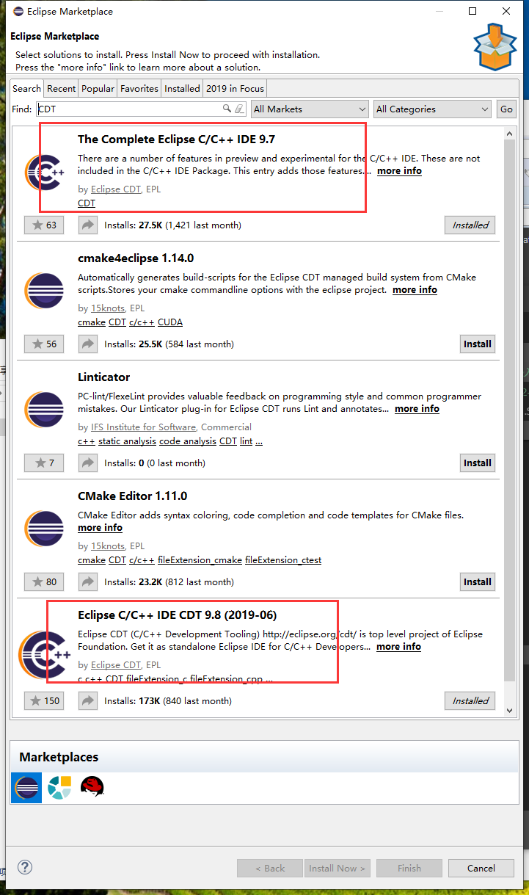
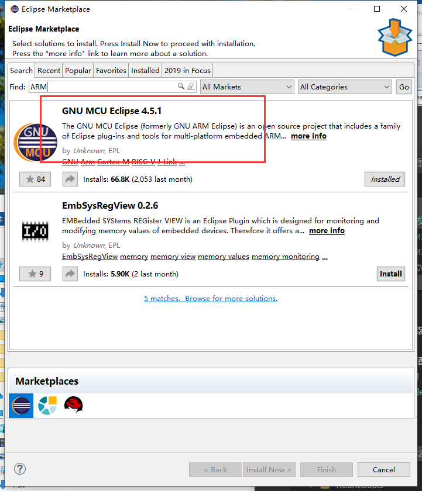
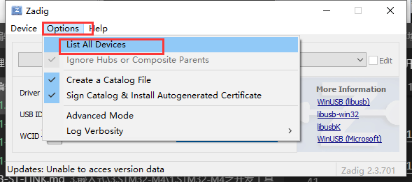
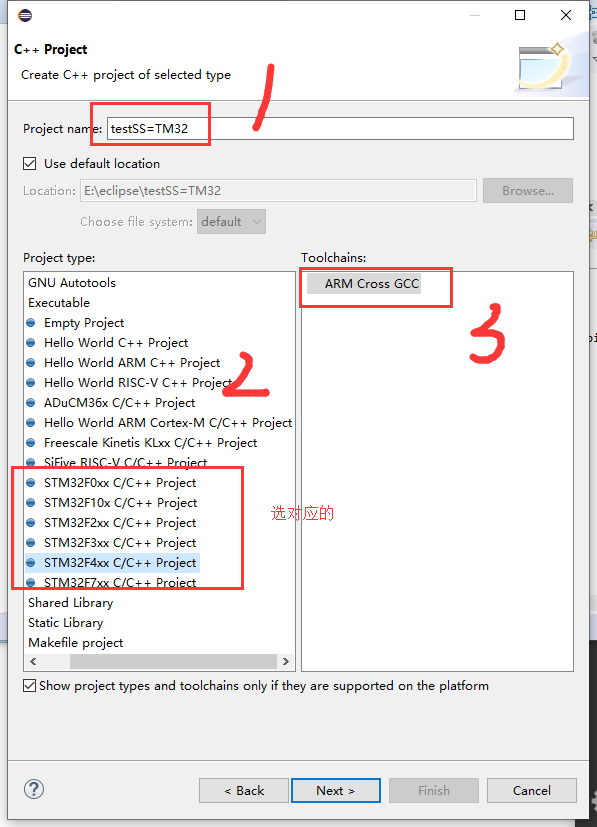
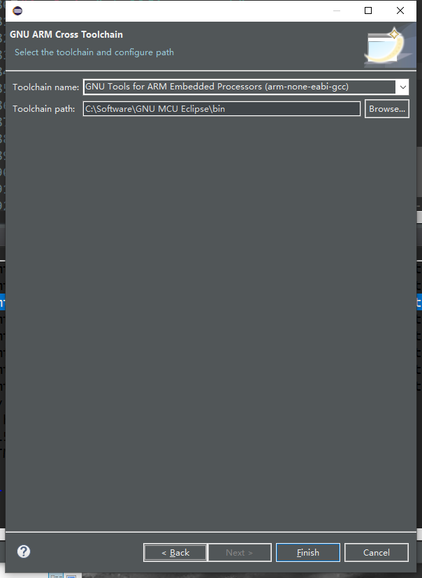
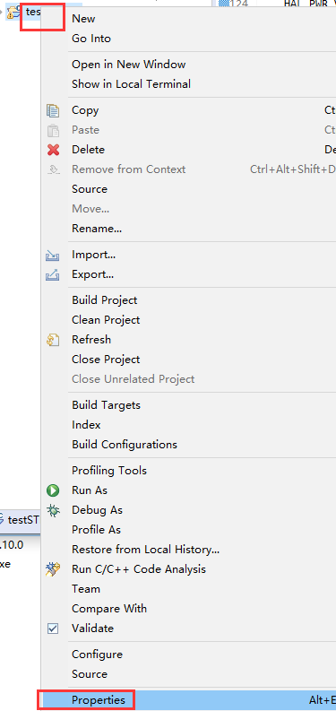
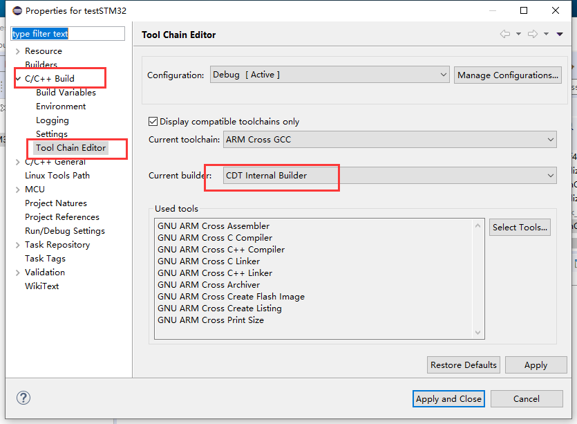

总操作流程：
- 1、[下载安装](#STM-M4-01)
- 2、[配置](#STM-M4-02)
- 3、[测试](#STM-M4-03)

***

# <a name="STM-M4-01" href="#" >下载安装</a>

> 1、下载安装jdk

[](https://github.com/OurNotes/CCN/blob/master/6.%E5%90%8E%E5%8F%B0/1.java/1.java%E4%B9%8B%E5%BC%80%E5%8F%91%E5%B7%A5%E5%85%B7/1.JDK/1-JDK%E4%B9%8B%E4%B8%8B%E8%BD%BD%E4%B8%8E%E9%85%8D%E7%BD%AE.md)

> 2、下载安装eclipse

[](https://wiki.eclipse.org/Eclipse/Installation)

>4、下载安装ST-LINK

[](https://github.com/OurNotes/CCN/blob/master/3.%E5%B5%8C%E5%85%A5%E5%BC%8F/3.STM32-M4/1.STM32-M4%E4%B9%8B%E5%BC%80%E5%8F%91%E5%B7%A5%E5%85%B7/3-ST-LINK.md)

> 3、下载安装zadig

[](https://pan.baidu.com/s/1NfiAHimlfIchbWI9n5x3XQ)

密钥：1b6a

> 4、下载安装MinGW

[](https://github.com/OurNotes/CCN/blob/master/6.%E5%90%8E%E5%8F%B0/2.C%E8%AF%AD%E6%B3%95/1.C%E8%AF%AD%E8%A8%80%E4%B9%8B%E5%BC%80%E5%8F%91%E5%B7%A5%E5%85%B7/1-MinGW.md)

> 5、下载解压：openocd

[](https://pan.baidu.com/s/1nPphURPYoQQUFS1dzSa3VQ)

密钥：85xj

> 6、下载解压：gcc-arm

[](https://pan.baidu.com/s/1DlyQE0WPGHZy0lKiFCm_Qw)

密钥：4bfr

> 7、使用node.js安装windows-build-tools

```
cnpm i -g windows-build-tools --vs2018
```


# <a name="STM-M4-02" href="#" >配置</a>

> 1、eclipse

- 1、安装插件

```
CDT
```




```
ARM
```



> 2、zadig配置

- 开版使用ST-LINK调试方式连上电脑




>3、配置环境变量：openocd
```
变量名：OPENOCD_HOME
变量值：C:\Software\openocd-0.10.0

path后加：%OPENOCD_HOME%\bin
```

> 4、配置变量环境：gcc-arm

```
变量名：ARM_HOME
变量值：C:\Software\gcc-arm-none-eabi-8-2018-q4-major-win32

path后加：%ARM_HOME%\bin
```

# <a name="STM-M4-03" href="#" >测试</a>

- 1、新增项目








- 2、配置项目



- 3、编译测试
