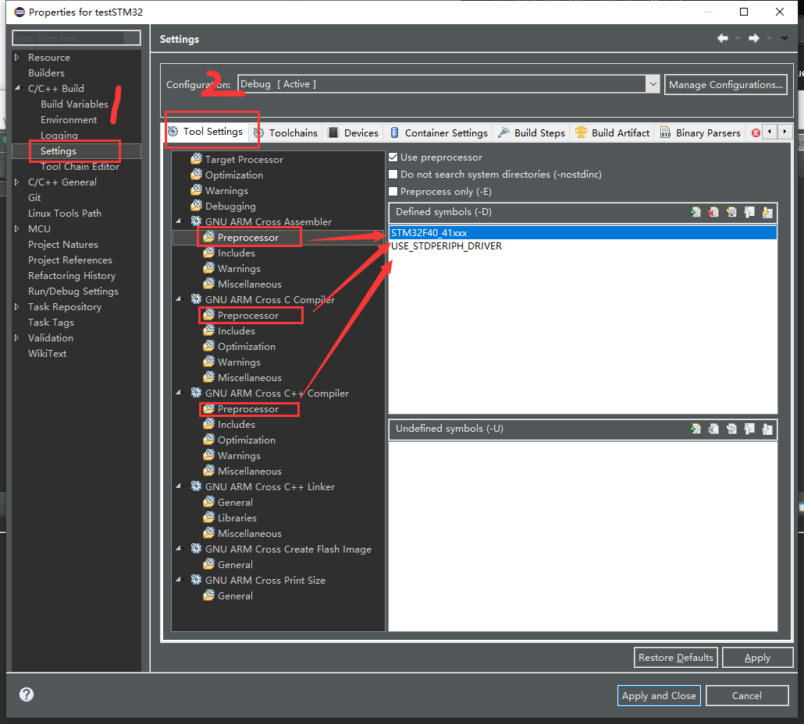

总操作流程：
- 1、[下载做好的模板](#STM-M4-01)
- 2、[导入](#STM-M4-02)
- 3、[配置](#STM-M4-03)
- 4、[编译后烧写](#STM-M4-04)

# <a name="STM-M4-01" href="#" >下载做好的模板</a>

# <a name="STM-M4-02" href="#" >导入</a>

# <a name="STM-M4-03" href="#" >配置</a>

> 1、配置项目函数指定路径

> 2、配置项目运行路径

密钥：zjg7

# <a name="STM-M4-04" href="#" >编译后烧写</a>

