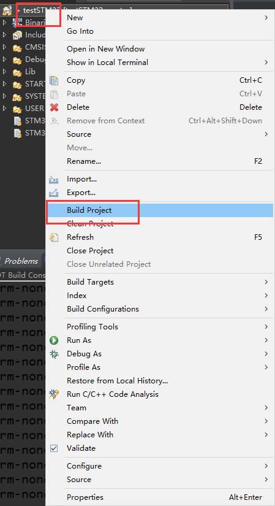

总操作流程：
- 1、创建文件
- 2、配置
- 3、测试

> 该教程建立在模板建立好的基础上

***

# 创建文件

> 1、根目录建立Module文件夹,且迁移led.c和led.h文件到其下
> 2、创建文件beep.c和beep.h文件

- beep.c

```c
#include "beep.h"
//初始化 PF8 为输出口
//BEEP IO 初始化
void BEEP_Init(void)
{
	GPIO_InitTypeDef GPIO_InitStructure;
	RCC_AHB1PeriphClockCmd(RCC_AHB1Periph_GPIOF, ENABLE);//使能 GPIOF 时钟
	//初始化蜂鸣器对应引脚 GPIOF8
	GPIO_InitStructure.GPIO_Pin = GPIO_Pin_8;
	GPIO_InitStructure.GPIO_Mode = GPIO_Mode_OUT;//普通输出模式
	GPIO_InitStructure.GPIO_OType = GPIO_OType_PP;//推挽输出
	GPIO_InitStructure.GPIO_Speed = GPIO_Speed_100MHz;//100MHz
	GPIO_InitStructure.GPIO_PuPd = GPIO_PuPd_DOWN;//下拉
	GPIO_Init(GPIOF, &GPIO_InitStructure);//初始化 GPIO
	GPIO_ResetBits(GPIOF,GPIO_Pin_8); //蜂鸣器对应引脚 GPIOF8 拉低，
}
```

- beep.h

```c
#ifndef __BEEP_H
#define __BEEP_H
#include "sys.h"
//LED 端口定义
#define BEEP PFout(8) // 蜂鸣器控制 IO
void BEEP_Init(void);//初始化
#endif

```


> 3、修改main.c文件

- main.c

```c
#include "sys.h"
#include "delay.h"
#include "usart.h"
#include "led.h"
#include "beep.h"
int main(void)
{
delay_init(168); //初始化延时函数
LED_Init(); //初始化 LED 端口
BEEP_Init(); //初始化蜂鸣器端口
	while(1)
	{
		GPIO_ResetBits(GPIOF,GPIO_Pin_9); // DS0 拉低，亮 等同 LED0=0;
		GPIO_ResetBits(GPIOF,GPIO_Pin_8); //BEEP 引脚拉低， 等同 BEEP=0;
		delay_ms(300); //延时 300ms
		GPIO_SetBits(GPIOF,GPIO_Pin_9); // DS0 拉高，灭 等同 LED0=1;
		GPIO_SetBits(GPIOF,GPIO_Pin_8); //BEEP 引脚拉高， 等同 BEEP=1;
		delay_ms(300); //延时 300ms
	}
}

```

# 配置


# 测试




