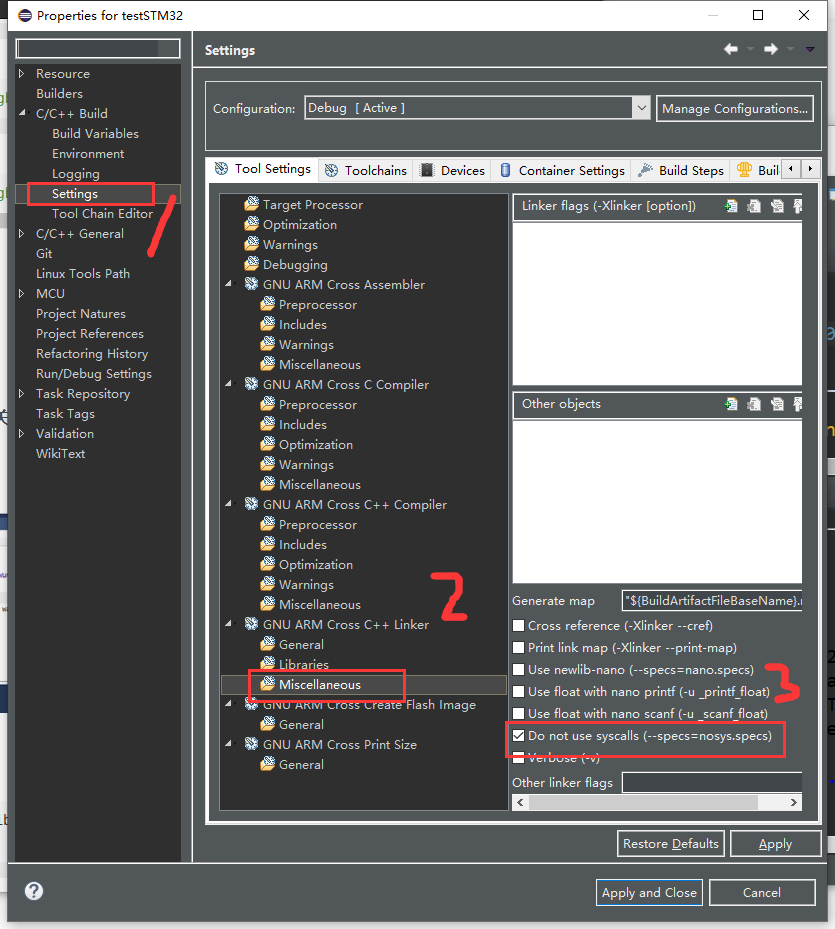

# 报错

```c
c:/software/gnu mcu eclipse/bin/../lib/gcc/arm-none-eabi/8.2.1/../../../../arm-none-eabi/bin/ld.exe: c:/software/gnu mcu eclipse/bin/../lib/gcc/arm-none-eabi/8.2.1/../../../../arm-none-eabi/lib/thumb/v7-m/nofp\libg.a(lib_a-sbrkr.o): in function `_sbrk_r':
sbrkr.c:(.text._sbrk_r+0xc): undefined reference to `_sbrk'
c:/software/gnu mcu eclipse/bin/../lib/gcc/arm-none-eabi/8.2.1/../../../../arm-none-eabi/bin/ld.exe: c:/software/gnu mcu eclipse/bin/../lib/gcc/arm-none-eabi/8.2.1/../../../../arm-none-eabi/lib/thumb/v7-m/nofp\libg.a(lib_a-writer.o): in function `_write_r':
writer.c:(.text._write_r+0x12): undefined reference to `_write'
c:/software/gnu mcu eclipse/bin/../lib/gcc/arm-none-eabi/8.2.1/../../../../arm-none-eabi/bin/ld.exe: c:/software/gnu mcu eclipse/bin/../lib/gcc/arm-none-eabi/8.2.1/../../../../arm-none-eabi/lib/thumb/v7-m/nofp\libg.a(lib_a-closer.o): in function `_close_r':
closer.c:(.text._close_r+0xc): undefined reference to `_close'
c:/software/gnu mcu eclipse/bin/../lib/gcc/arm-none-eabi/8.2.1/../../../../arm-none-eabi/bin/ld.exe: c:/software/gnu mcu eclipse/bin/../lib/gcc/arm-none-eabi/8.2.1/../../../../arm-none-eabi/lib/thumb/v7-m/nofp\libg.a(lib_a-lseekr.o): in function `_lseek_r':
lseekr.c:(.text._lseek_r+0x12): undefined reference to `_lseek'
c:/software/gnu mcu eclipse/bin/../lib/gcc/arm-none-eabi/8.2.1/../../../../arm-none-eabi/bin/ld.exe: c:/software/gnu mcu eclipse/bin/../lib/gcc/arm-none-eabi/8.2.1/../../../../arm-none-eabi/lib/thumb/v7-m/nofp\libg.a(lib_a-readr.o): in function `_read_r':
readr.c:(.text._read_r+0x12): undefined reference to `_read'
c:/software/gnu mcu eclipse/bin/../lib/gcc/arm-none-eabi/8.2.1/../../../../arm-none-eabi/bin/ld.exe: c:/software/gnu mcu eclipse/bin/../lib/gcc/arm-none-eabi/8.2.1/../../../../arm-none-eabi/lib/thumb/v7-m/nofp\libg.a(lib_a-fstatr.o): in function `_fstat_r':
fstatr.c:(.text._fstat_r+0x10): undefined reference to `_fstat'
c:/software/gnu mcu eclipse/bin/../lib/gcc/arm-none-eabi/8.2.1/../../../../arm-none-eabi/bin/ld.exe: c:/software/gnu mcu eclipse/bin/../lib/gcc/arm-none-eabi/8.2.1/../../../../arm-none-eabi/lib/thumb/v7-m/nofp\libg.a(lib_a-isattyr.o): in function `_isatty_r':
isattyr.c:(.text._isatty_r+0xc): undefined reference to `_isatty'
collect2.exe: error: ld returned 1 exit statu
```

# 解决

