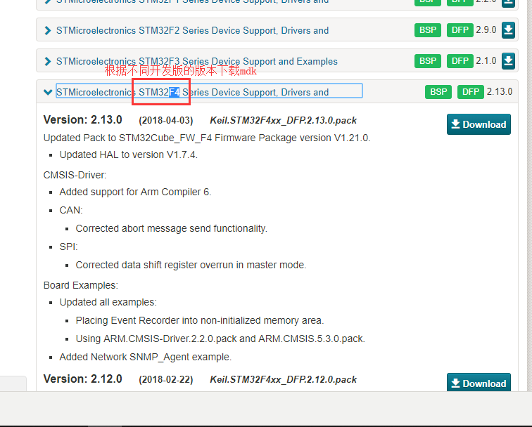
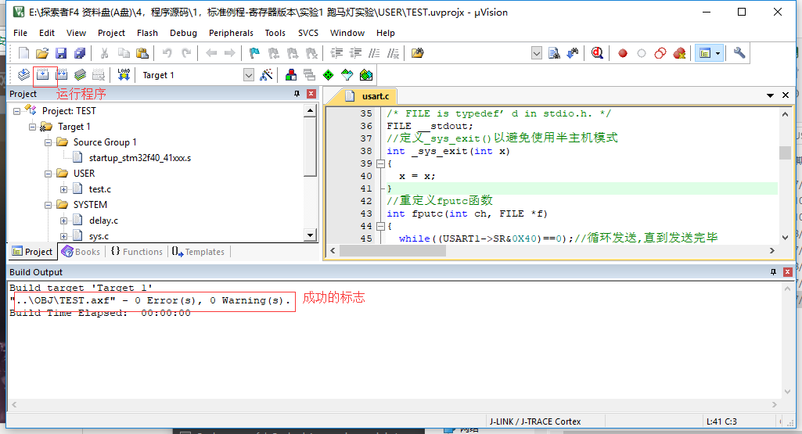

总操作流程：
- 1、[下载安装](#mdk-01)
- 2、[破解](#mdk-02)
- 3、[看效果](#mdk-03)

***

# <a name="mdk-01" href="#" >下载安装</a>
- 下载安装mdk

- 固件下载

- 固件安装

`
安装mdk5后，双击pack文件，进行安装固件。
`

# <a name="mdk-02" href="#" >破解</a>

`以管理员的身份打开软件，进入注册界面file》License Management`

# <a name="mdk-03" href="#" >看效果</a>

