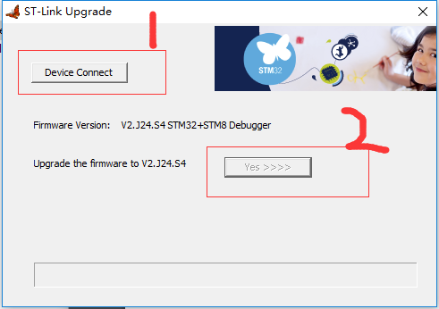

总操作流程：
- 1、[下载安装](#ST-LINK-01)
- 2、[固件升级](#ST-LINK-02)

***

# <a name="ST-LINK-01" href="#" >下载安装</a>
- 下载安装

`安装dpinst_amd64.exe文件`

- 成功标志

`通过usb连接电脑`

# <a name="ST-LINK-02" href="#" >固件升级</a>

`ST-Link板要通过usb连接电脑，选择Windows文件夹下的ST-LinkUpgrade.exe进行升级`

