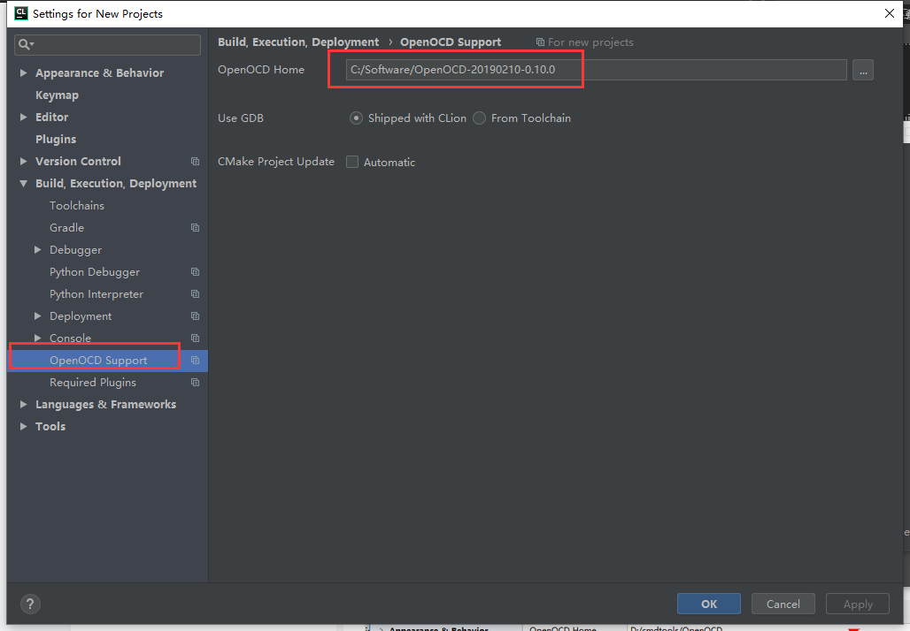
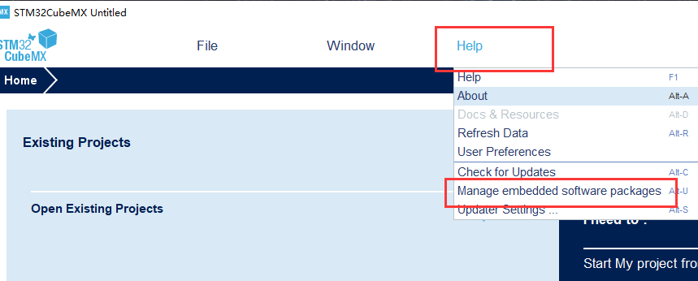
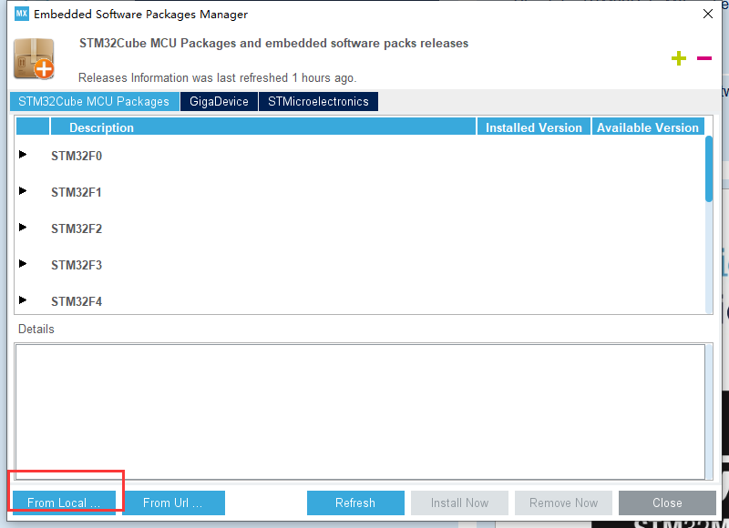
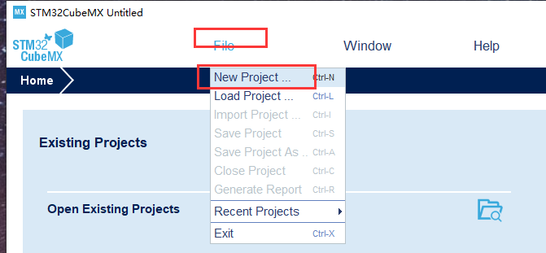
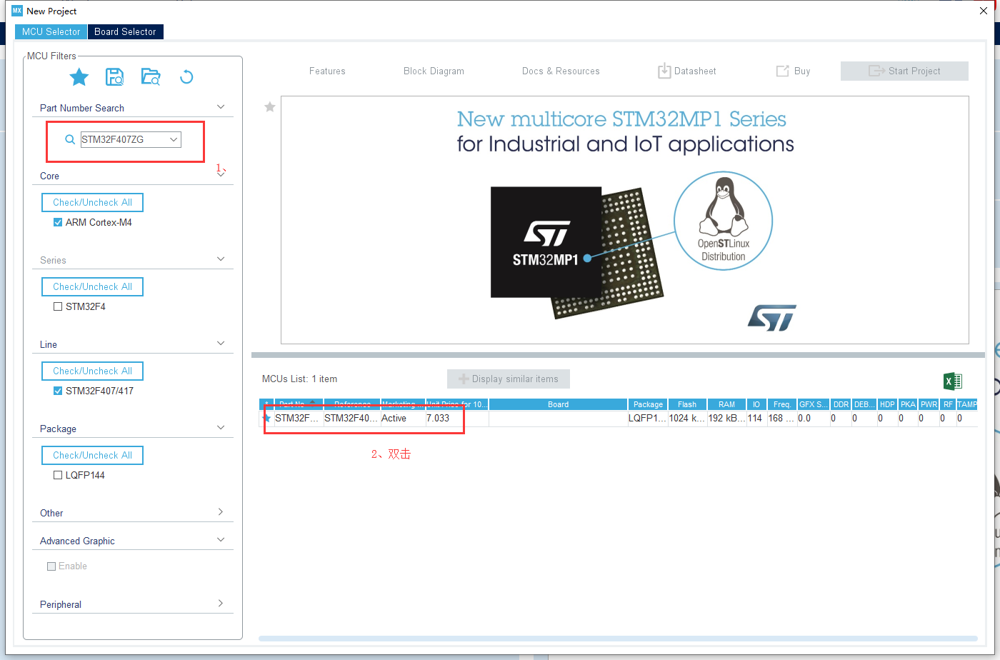
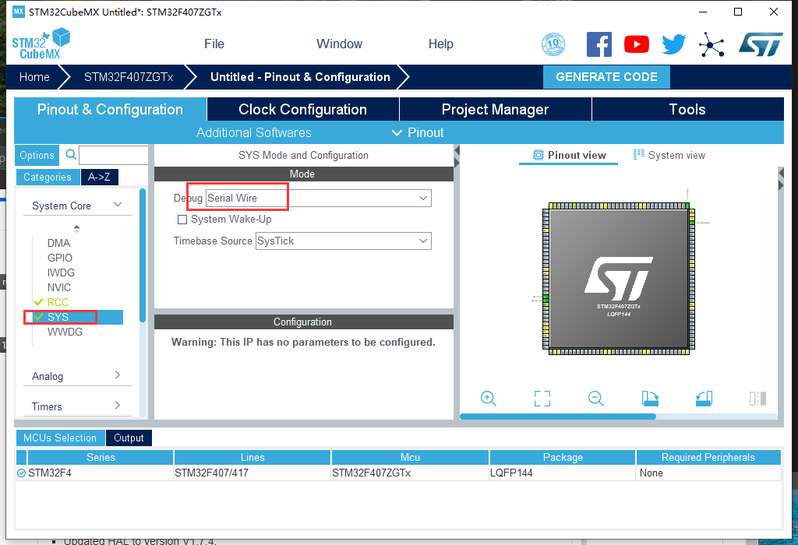

总操作流程：
- 1、下载安装
- 2、配置
- 3、测试

***

# 下载安装

> 1、下载安装STM32CubeMx

[](https://pan.baidu.com/s/1SYJbBcy7pAGi1v0pAny2nQ)

提取码: z9j2

>2、下载安装Clion

[](https://github.com/OurNotes/CCN/blob/master/6.%E5%90%8E%E5%8F%B0/2.C%E8%AF%AD%E6%B3%95/1.C%E8%AF%AD%E8%A8%80%E4%B9%8B%E5%BC%80%E5%8F%91%E5%B7%A5%E5%85%B7/2-CLion.md)

>3、下载安装arm

[](https://pan.baidu.com/s/1OmKnG0NvqKxK4BVeMCnJlQ)

提取码: hewg

>4、下载安装MinGW

[](https://github.com/OurNotes/CCN/blob/master/6.%E5%90%8E%E5%8F%B0/2.C%E8%AF%AD%E6%B3%95/1.C%E8%AF%AD%E8%A8%80%E4%B9%8B%E5%BC%80%E5%8F%91%E5%B7%A5%E5%85%B7/1-MinGW.md)

>5、下载安装openocd

- 解压配置环境就行

[](https://pan.baidu.com/s/1TLdo1LyW6OH4Ldnk6wFouw)

提取码: fr2z


# 配置

> 1、配置arm

```
变量名称：ARM_HOME
变量值：C:\Software\gcc-arm-none-eabi-8-2018-q4-major-win32
```

path：;%ARM_HOME%\bin

- 测试：arm-none-eabi-gcc -v

> 2、clion配置MinGW


>3、clion配置openocd




# 测试

> 1、使用STM32Cobe创建项目

- 1-1、下载固件安装固件

[](http://www.keil.com/dd2/pack/#/third-party-download-dialog)


- 1-2、导入固件





- 3、创建项目







- 4、导出项目


> 2、clion导入项目


