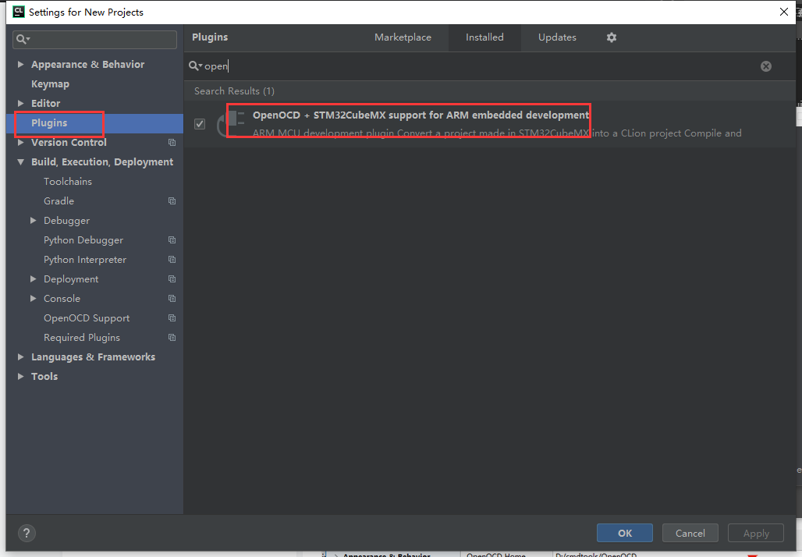

总操作流程：
- 1、下载安装软件
- 2、测试

# 下载安装软件

> 1、安装vs code插件：

- PlatformIO IDE
- C/C++
- C/C++ Clang Command Adapter
- C/C++ Snippets
- C++ Intellisense
- Bracket Pair Colorizer


# 测试

>1、创建stm32项目

```
STM32F103C8
```



> 2、配置platformio.ini
```ini
[env:genericSTM32F103C8]
platform = ststm32
board = genericSTM32F103C8
framework = stm32cube
upload_protocol=stlink
```


