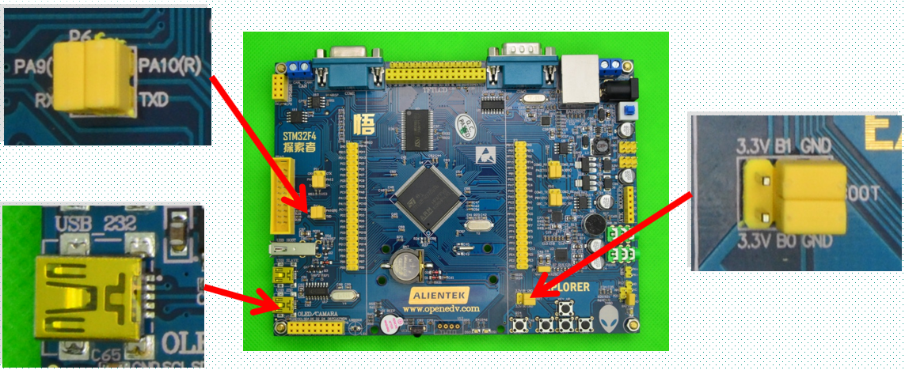
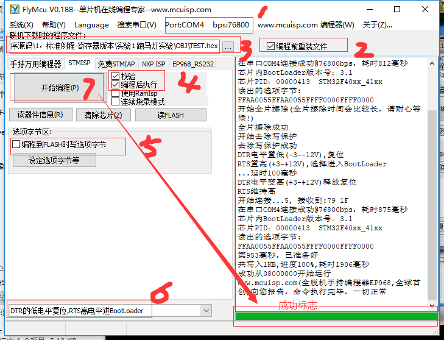

总操作流程：
- 1、[硬件连接](#STM-M4-01)
- 2、[下载安装工具：mcuisp(FlyMcu)](#STM-M4-02)
- 3、[配置工具](#STM-M4-03)

***

# <a name="STM-M4-01" href="#" >硬件连接</a>

`通过usb连接电脑`

# <a name="STM-M4-02" href="#" >下载安装工具：mcuisp(FlyMcu)</a>

# <a name="STM-M4-03" href="#" >配置工具</a>

`点击读器件信息按钮看效果`