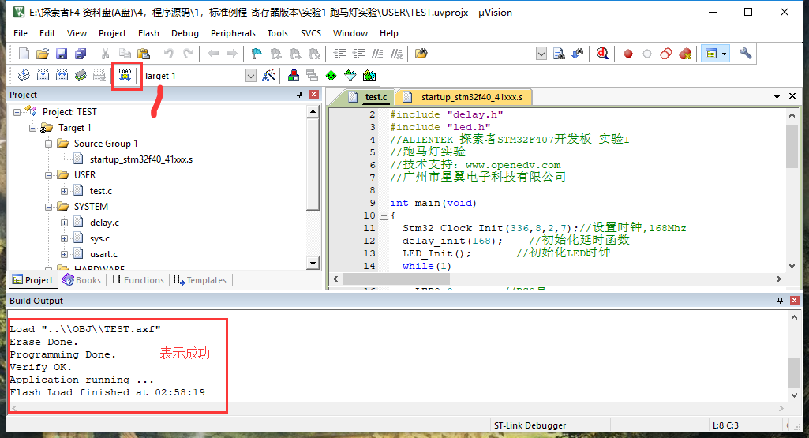

总操作流程：
- 1、[硬件连接](#STM-M4-01)
- 2、[mdk5的设置](#STM-M4-02)
- 3、[测试](#STM-M4-03)

***

# <a name="STM-M4-01" href="#" >硬件连接</a>

# <a name="STM-M4-02" href="#" >mdk5的设置</a>

# <a name="STM-M4-03" href="#" >测试</a>

`使用mdk5打开实验1 跑马灯实验\USER下的TEST.uvprojx文件`

