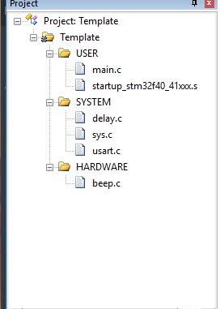

总操作流程：
- 1、[下载模板](#STM-M4-01)
- 2、[创建修改文件和配置环境](#STM-M4-02)
    - 2.[1、创建修改文件夹和文件](#STM-M4-02-01)
    - 2.[2、配置环境](#STM-M4-02-02)
- 3、[程序下载看效果](#STM-M4-03)


***

# <a name="STM-M4-01" href="#" >下载模板</a>

[](https://github.com/lidekai/Template-RegisterLibrary.git)

# <a name="STM-M4-02" href="#" >创建修改文件和配置环境</a>

### <a name="STM-M4-02-01" href="#" >1、创建修改文件夹和文件</a>
- 将根目录名改成：Template
- 创建OBJ文件夹
- 创建HARDWARE文件夹，且其下也创建BEEP文件夹
- 在LED文件夹下创建beep.c和beep.h文件
- beep.h
```
#ifndef __BEEP_H
#define __BEEP_H
#include "sys.h"

#define BEEP PFout(8) // 蜂鸣器控制 IO

void BEEP_Init(void); //初始化

#endif

```
- beep.c
```
#include "beep.h"
//初始化 PB8 为输出口.并使能这个口的时钟
//蜂鸣器初始化
void BEEP_Init(void)
{
	RCC->AHB1ENR|=1<<5; //使能 PORTF 时钟
	/**
	* 作用：PF8 设置,下拉
	* 解释：
	*      GPIOF:是IO 口。
	*      PIN8：是引脚编号，定义值是：1<<8。
	*      GPIO_MODE_OUT：是普通输出模式，定义值是：1。
	*      GPIO_OTYPE_PP：是推挽输出，定义值是：0。
	*      GPIO_SPEED_100M：是GPIO 速度 100Mhz，定义值是：3。
	*      GPIO_PUPD_PD: 是下拉，定义值是：2。
	*/
	GPIO_Set(GPIOF,
					 PIN8,
					 GPIO_MODE_OUT,
					 GPIO_OTYPE_PP,
					 GPIO_SPEED_100M,
					 GPIO_PUPD_PD);
	BEEP=0; //关闭蜂鸣器
}


```

- 修改main.c文件内容
```
#include "sys.h"
#include "delay.h"
#include "beep.h"

int main(void)
{
	Stm32_Clock_Init(336,8,2,7);//设置时钟,168Mhz
	delay_init(168); //初始化延时函数
	BEEP_Init(); //初始化蜂鸣器端口
	while(1)
	{
		BEEP=0;
		delay_ms(300);
		BEEP=1;
		delay_ms(300);
	}
}


```
### <a name="STM-M4-02-02" href="#" >2、配置环境</a>
- 导入文件



- 设置文件路径

`STM32F40_41xxx`


# <a name="STM-M4-03" href="#" >程序下载看效果</a>
- 编译


- 将程序下载到开发板


- 看效果

`开发板嘀嘀嘀的响`