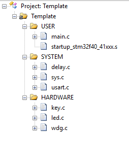
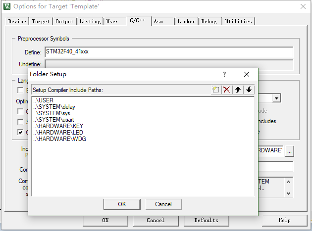

总操作流程：
- 1、[下载模板](#STM-M4-01)
- 2、[创建修改文件和配置环境](#STM-M4-02)
    - 2.[1、创建修改文件夹和文件](#STM-M4-02-01)
    - 2.[2、配置环境](#STM-M4-02-02)
- 3、[看效果](#STM-M4-03)

***

# <a name="STM-M4-01" href="#" >下载模板</a>

[](https://github.com/lidekai/Template-RegisterLibrary.git)

# <a name="STM-M4-02" href="#" >创建修改文件和配置环境</a>

### <a name="STM-M4-02-01" href="#" >1、创建修改文件夹和文件</a>

- 将根目录名改成：Template
- 创建OBJ文件夹
- 创建HARDWARE文件夹，且其下也创建WDG文件夹
- 在WDG文件夹下创建wdg.c和wdg.h文件
- wdg.h
```h
#ifndef __WDG_H
#define __WDG_H
#include "sys.h"
  void IWDG_Init(u8 prer,u16 rlr);
  void IWDG_Feed(void);
#endif


```

- wdg.c
```c
#include "wdg.h"
//初始化独立看门狗
//prer:分频数:0~7(只有低 3 位有效!)
//rlr:自动重装载值,0~0XFFF.
//分频因子=4*2^prer.但最大值只能是 256!
//rlr:重装载寄存器值:低 11 位有效.
//时间计算(大概):Tout=((4*2^prer)*rlr)/32 (ms).
void IWDG_Init(u8 prer,u16 rlr)
{
  IWDG->KR=0X5555;//使能对 IWDG->PR 和 IWDG->RLR 的写
  IWDG->PR=prer; //设置分频系数
  IWDG->RLR=rlr; //重加载寄存器 IWDG->RLR
  IWDG->KR=0XAAAA;//reload
  IWDG->KR=0XCCCC;//使能看门狗
}
//喂独立看门狗
void IWDG_Feed(void)
{
  IWDG->KR=0XAAAA;//reload
}

```

- main.c

```c
#include "delay.h"
#include "led.h"
#include "key.h"
#include "wdg.h"

int main(void)
{
	Stm32_Clock_Init(336,8,2,7);//设置时钟,168Mhz
	delay_init(168); //延时初始化
	LED_Init(); //初始化与 LED 连接的硬件接口
	KEY_Init(); //初始化按键
	delay_ms(100); //延时 100ms 再初始化看门狗,LED0 的变化"可见"
	IWDG_Init(4,500); //预分频数为 64,重载值为 500,溢出时间为 1s
	LED0=0; //点亮 LED0
	while(1)
	{
	if(KEY_Scan(0)==WKUP_PRES)//如果 WK_UP 按下,则喂狗
	{
		IWDG_Feed();//喂狗
	}
		delay_ms(10);
	};
}


```

### <a name="STM-M4-02-02" href="#" >2、配置环境</a>

- 导入文件



- 设置文件路径

`STM32F40_41xxx`



# <a name="STM-M4-03" href="#" >看效果</a>

- 下载程序


- 看效果

`一直不停地按：KEY_UP键，闪的红灯就不再闪`
