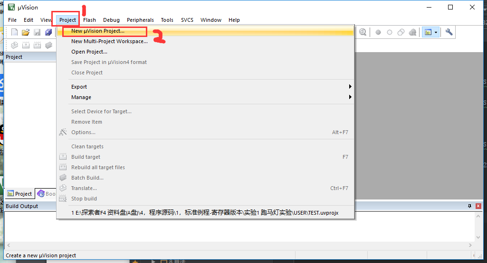
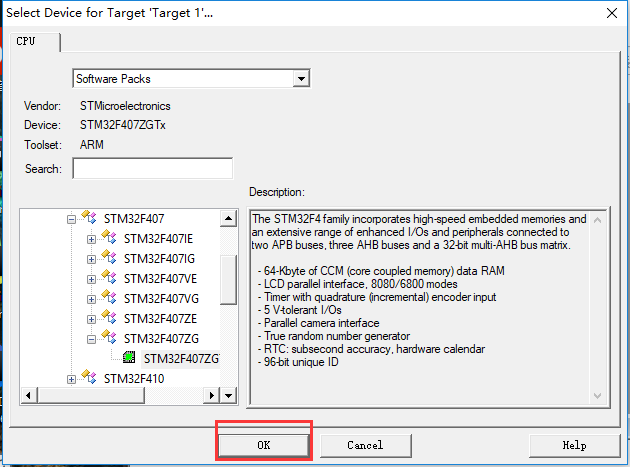
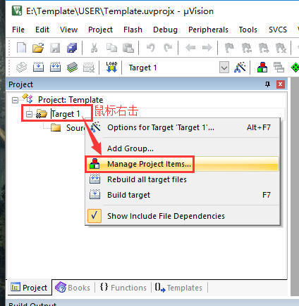
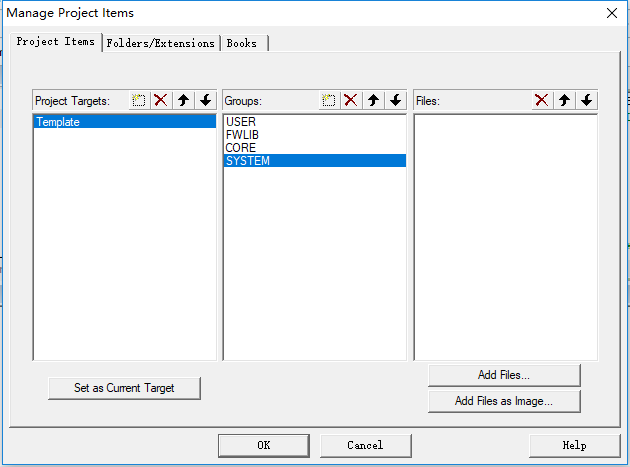
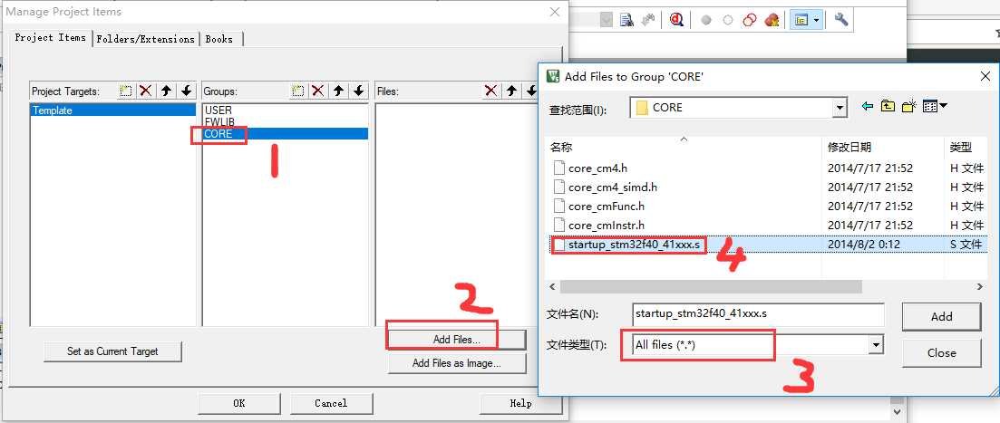
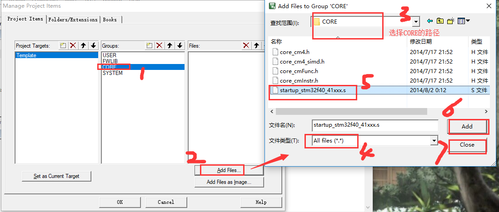
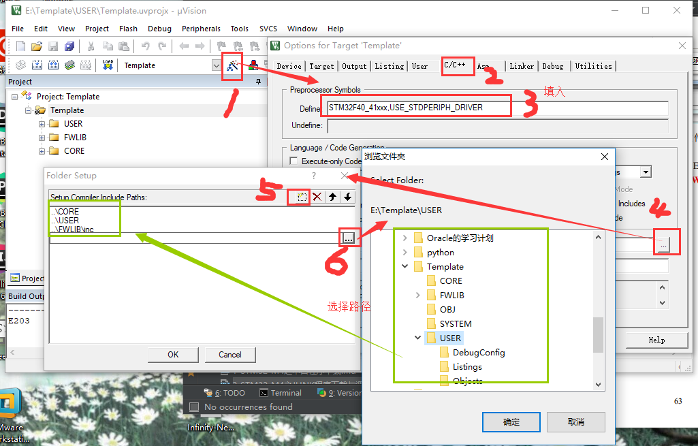
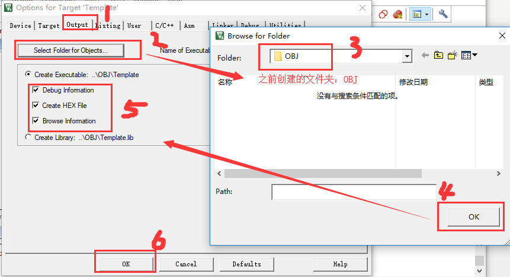

总操作流程：
- 1、创建文件夹与复制官方固件
- 2、mdk5配置
- 3、修改文件
- 4、程序下载看效果

***

# 创建文件夹与复制官方固件

### 1、创建文件夹
- Template
    - CORE
    - FWLIB
    - OBJ
    - SYSTEM
    - USER

### 2、复制官方固件

- 复制一份到FWLib文件夹下

1、文件夹STM32F4xx_DSP_StdPeriph_Lib_V1.4.0\Libraries\STM32F4xx_StdPeriph_Driver下的两个src,inc文件夹

- 复制一份到CORE文件夹下

1、文件夹STM32F4xx_DSP_StdPeriph_Lib_V1.4.0\Libraries\CMSIS\Device\ST\STM32F4xx\Source\Templates\arm下的startup_stm32f40_41xxx.s文件

2、文件夹STM32F4xx_DSP_StdPeriph_Lib_V1.4.0\Libraries\CMSIS\Include下的四个文件 ：core_cm4.h、core_cm4_simd.h、core_cmFunc.h 以及 core_cmInstr.h

- 复制一份到USER文件夹下

1、文件夹STM32F4xx_DSP_StdPeriph_Lib_V1.4.0\Libraries\CMSIS\Device\ST\STM32F4xx\Include下的2个文件 stm32f4xx.h 和 system_stm32f4xx.h

2、文件夹STM32F4xx_DSP_StdPeriph_Lib_V1.4.0\Project\STM32F4xx_StdPeriph_Templates下的5 个文件 main.c ， stm32f4xx_conf.h ， stm32f4xx_it.c ， stm32f4xx_it.h ，
     system_stm32f4xx.c

# mdk5配置

### 1、新建工程

`STMicroelectronicsSTM32F4 SeriesSTM32F407STM32F407ZG`

### 2、导入库文件

`修改成这样`

### 3、设置头文件存放路径

`
STM32F40_41xxx,USE_STDPERIPH_DRIVER
`

# 修改文件