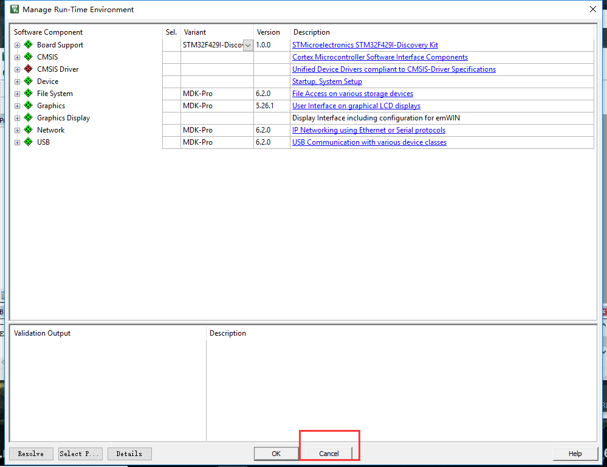
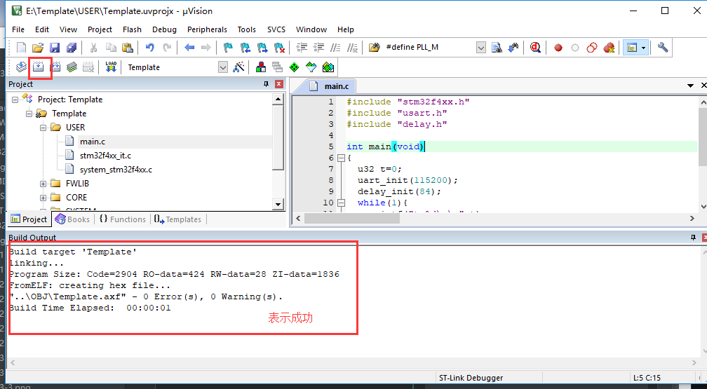

总操作流程：
- 1、[创建文件夹与复制官方固件](#STM-M4-01)
    - 1.[1、创建文件夹](#STM-M4-01-01)
    - 1.[2、复制官方固件](#STM-M4-01-02)
- 2、[mdk5配置](#STM-M4-02)
    - 2.[1、新建工程](#STM-M4-02-01)
    - 2.[2、导入库文件](#STM-M4-02-02)
    - 2.[3、设置头文件存放路径](#STM-M4-02-03)
- 3、[修改文件](#STM-M4-03)
    - 3.[1、修改main.c文件](#STM-M4-03-01)
    - 3.[2、修改stm32f4xx_it.c文件](#STM-M4-03-02)
    - 3.[3、修改System_stm32f4xx.c文件](#STM-M4-03-03)
- 4、[程序下载看效果](#STM-M4-04)
- 5、[固件库的模板](#STM-M4-05)

***

# <a name="STM-M4-01" href="#" >创建文件夹与复制官方固件</a>

### <a name="STM-M4-01-01" href="#" >1、创建文件夹</a>
- Template
    - CORE
    - FWLIB
    - OBJ
    - SYSTEM
    - USER

### <a name="STM-M4-01-02" href="#" >2、复制官方固件</a>
[](https://pan.baidu.com/s/1xzl-pU3svRJWJq7Gmx-XJQ)

- 复制一份到FWLib文件夹下

1、文件夹STM32F4xx_DSP_StdPeriph_Lib_V1.4.0\Libraries\STM32F4xx_StdPeriph_Driver下的两个src,inc文件夹

- 复制一份到CORE文件夹下

1、文件夹STM32F4xx_DSP_StdPeriph_Lib_V1.4.0\Libraries\CMSIS\Device\ST\STM32F4xx\Source\Templates\arm下的startup_stm32f40_41xxx.s文件

2、文件夹STM32F4xx_DSP_StdPeriph_Lib_V1.4.0\Libraries\CMSIS\Includ下的四个文件 ：core_cm4.h、core_cm4_simd.h、core_cmFunc.h 以及 core_cmInstr.h

- 复制一份到USER文件夹下

1、文件夹STM32F4xx_DSP_StdPeriph_Lib_V1.4.0\Libraries\CMSIS\Device\ST\STM32F4xx\Include下的2个文件 stm32f4xx.h 和 system_stm32f4xx.h

2、文件夹STM32F4xx_DSP_StdPeriph_Lib_V1.4.0\Project\STM32F4xx_StdPeriph_Templates下的5 个文件 main.c ， stm32f4xx_conf.h ， stm32f4xx_it.c ， stm32f4xx_it.h ，
     system_stm32f4xx.c

- 复制一份到SYSTEM文件夹下

解压所有文件复制到SYSTEM文件夹下

[](https://pan.baidu.com/s/1_my0ZKbXjw3F0LHo22UIpA)


# <a name="STM-M4-02" href="#" >mdk5配置</a>

### <a name="STM-M4-02-01" href="#" >1、新建工程</a>


`STMicroelectronicsSTM32F4 SeriesSTM32F407STM32F407ZG`




### <a name="STM-M4-02-02" href="#" >2、导入库文件</a>


`修改成这样`


- USER


- FWLIB


- CORE


- SYSTEM


### <a name="STM-M4-02-03" href="#" >3、设置头文件存放路径</a>

`
STM32F40_41xxx,USE_STDPERIPH_DRIVER
`


# <a name="STM-M4-03" href="#" >修改文件</a>
### <a name="STM-M4-03-01" href="#" >1、修改main.c文件</a>
```
#include "stm32f4xx.h"
#include "usart.h"
#include "delay.h"

int main(void)
{
	u32 t=0;
	uart_init(115200);
	delay_init(84);
	while(1){
	  printf("t:%d\r\n",t);
			delay_ms(500);
			t++;
	}
}

```
### <a name="STM-M4-03-02" href="#" >2、修改stm32f4xx_it.c文件</a>
删除
```
#include "main.h"
和
TimingDelay_Decrement();
```
### <a name="STM-M4-03-03" href="#" >3、修改System_stm32f4xx.c文件</a>
```
/* PLL_VCO = (HSE_VALUE or HSI_VALUE / PLL_M) * PLL_N */
#define PLL_M      25
```
改成
```
/* PLL_VCO = (HSE_VALUE or HSI_VALUE / PLL_M) * PLL_N */
#define PLL_M      8
```
# <a name="STM-M4-04" href="#" >程序下载看效果</a>
- 编译



- 将程序下载到开发板


- 看效果

[](https://pan.baidu.com/s/1iMreHEGIuCFW5OooHrUAKQ)


# <a name="STM-M4-05" href="#" >固件库的模板</a>

[](https://github.com/lidekai/Template-FirmwareLibrary.git)
