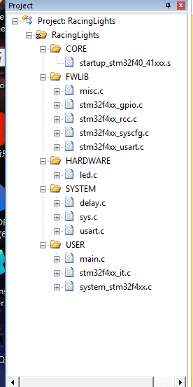
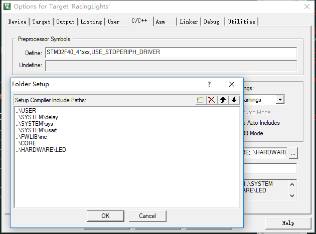

总操作流程：
- 1、[下载模板](#STM-M4-01)
- 2、[创建修改文件和配置环境](#STM-M4-02)
    - 2.[1、创建修改文件夹和文件](#STM-M4-02-01)
    - 2.[2、配置环境](#STM-M4-02-02)
- 3、[程序下载看效果](#STM-M4-03)

[](https://github.com/lidekai/RacingLights-FirmwareLibrary.git)

***

# <a name="STM-M4-01" href="#" >下载模板</a>
[](https://github.com/lidekai/Template-FirmwareLibrary.git)

# <a name="STM-M4-02" href="#" >创建修改文件和配置环境</a>

### <a name="STM-M4-02-01" href="#" >1、创建修改文件夹和文件</a>
- 将根目录名改成：RacingLights
- 创建OBJ文件夹
- 创建HARDWARE文件夹，且其下也创建LED文件夹
- 在LED文件夹下创建led.c和led.h文件
- led.c
```
#include "led.h"
#include "stm32f4xx.h"

/**
* LED IO 初始化
*/
void LED_Init(void)
{

 GPIO_InitTypeDef GPIO_InitStructure;

 RCC_AHB1PeriphClockCmd(RCC_AHB1Periph_GPIOF,ENABLE);//使能 GPIOF 时钟

//GPIOF9,F10 初始化设置
 GPIO_InitStructure.GPIO_Pin = GPIO_Pin_9 | GPIO_Pin_10;//LED0 和 LED1 对应 IO 口
 GPIO_InitStructure.GPIO_Mode = GPIO_Mode_OUT;//普通输出模式
 GPIO_InitStructure.GPIO_OType = GPIO_OType_PP;//推挽输出
 GPIO_InitStructure.GPIO_Speed = GPIO_Speed_100MHz;//100MHz
 GPIO_InitStructure.GPIO_PuPd = GPIO_PuPd_UP;//上拉

 GPIO_Init(GPIOF, &GPIO_InitStructure);//初始化 GPIO
 GPIO_SetBits(GPIOF,GPIO_Pin_9 | GPIO_Pin_10);//GPIOF9,F10 设置高，灯灭
}

```
- led.h
```
#ifndef  __LED_H

#define __LED_H

#include "sys.h"
//LED 端口定义
#define LED0 PFout(9) // DS0 PF9
#define LED1 PFout(10)// DS1 PF10

void LED_Init(void);//初始化


#endif


```

### <a name="STM-M4-02-02" href="#" >2、配置环境</a>
- 导入文件



- 设置文件路径

`STM32F40_41xxx,USE_STDPERIPH_DRIVER`




# <a name="STM-M4-03" href="#" >程序下载看效果</a>
- 编译


- 将程序下载到开发板


- 看效果

`开发板灯一闪闪的发亮`