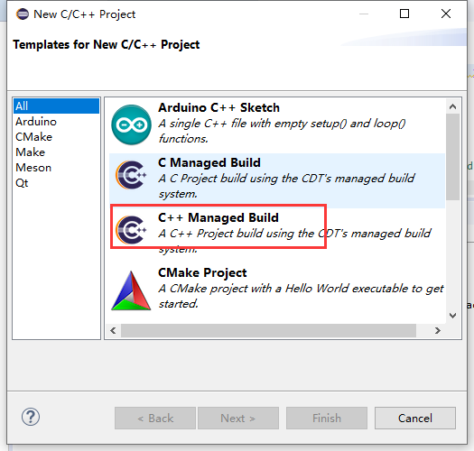

总操作流程：
- 1、下载安装
- 2、配置
- 3、测试

***

# 下载安装

> 1、下载安装jdk

[](https://github.com/OurNotes/CCN/blob/master/6.%E5%90%8E%E5%8F%B0/1.java/1.java%E4%B9%8B%E5%BC%80%E5%8F%91%E5%B7%A5%E5%85%B7/1.JDK/1-JDK%E4%B9%8B%E4%B8%8B%E8%BD%BD%E4%B8%8E%E9%85%8D%E7%BD%AE.md)

> 2、下载安装eclipse

[](https://wiki.eclipse.org/Eclipse/Installation)

>4、下载安装ST-LINK

[](https://github.com/OurNotes/CCN/blob/master/3.%E5%B5%8C%E5%85%A5%E5%BC%8F/3.STM32-M4/1.STM32-M4%E4%B9%8B%E5%BC%80%E5%8F%91%E5%B7%A5%E5%85%B7/3-ST-LINK.md)

> 3、下载安装zadig

[](https://pan.baidu.com/s/1NfiAHimlfIchbWI9n5x3XQ)

密钥：1b6a

> 4、下载安装MinGW

[](https://github.com/OurNotes/CCN/blob/master/6.%E5%90%8E%E5%8F%B0/2.C%E8%AF%AD%E6%B3%95/1.C%E8%AF%AD%E8%A8%80%E4%B9%8B%E5%BC%80%E5%8F%91%E5%B7%A5%E5%85%B7/1-MinGW.md)


# 配置

> 1、eclipse

- 1、安装插件

```
CDT
```


```
ARM
```


- 2、配置mingw





> 2、zadig配置

- 开版使用ST-LINK调试方式连上电脑


# 测试

