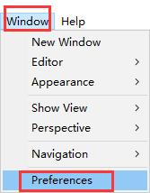
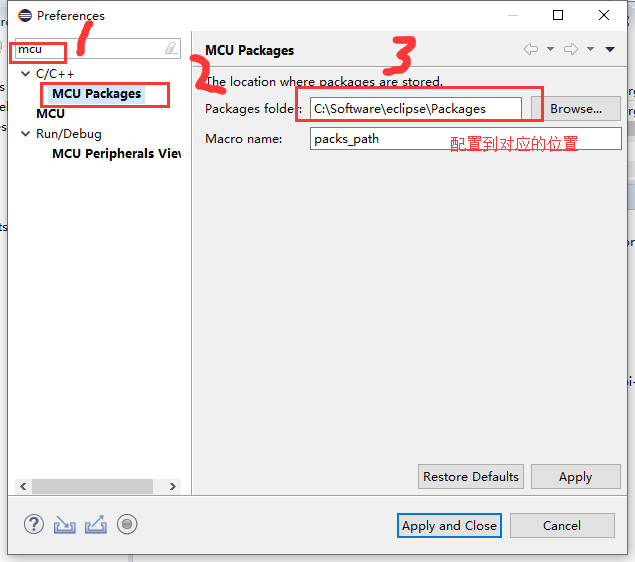
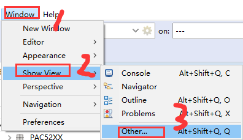
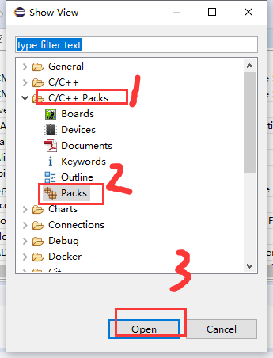
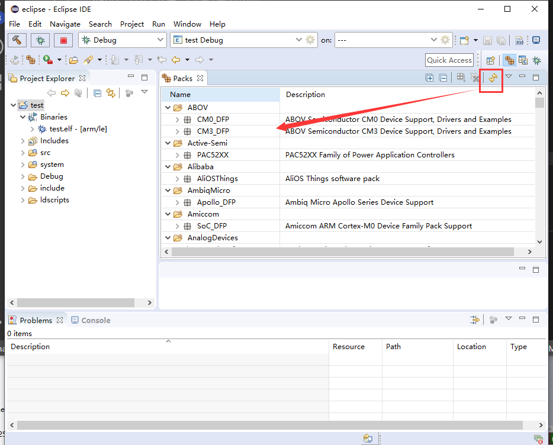
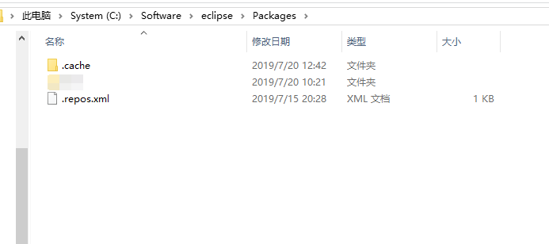
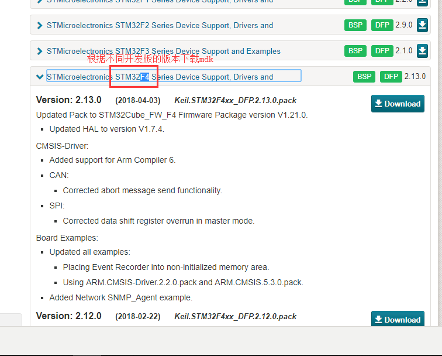
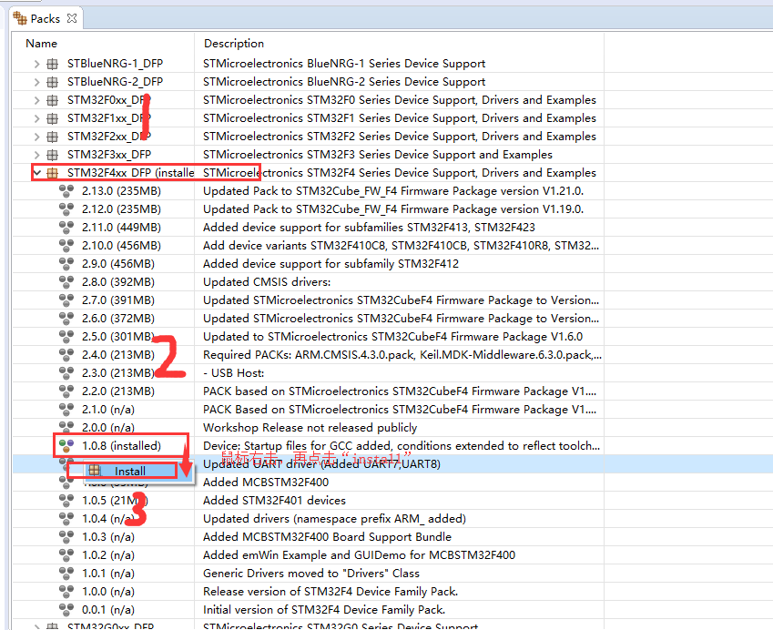
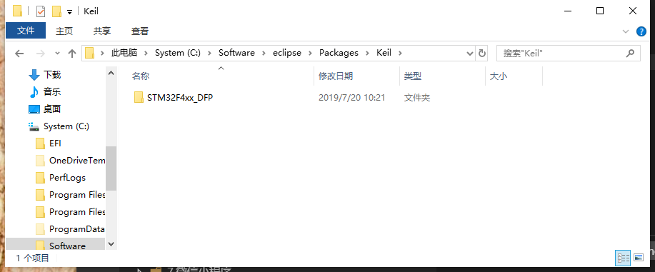

总操作流程
- 1、配置
- 2、下载包
- 3、看效果

***

# 配置

# 下载包

> 1、包的下载

- 方式一，是通过eclipse进行下载更新包，这种花时间长

- 方式二，是本人下载好的包，解压放到上一步配置好的路径,重启eclipse就可以了。

密钥：mxqp

> 2、固件的下载安装

- 下载

`本人下载的是：Keil.STM32F4xx_DFP.1.0.8.pack`

密钥：81rj

- 安装

`将下载好的包,放到上一步配置的文件夹下的C:\Software\eclipse\Packages\.cache下`

`找到对应的版本进行安装`

# 看效果

