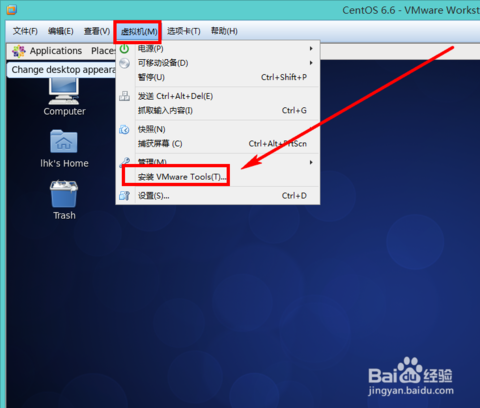
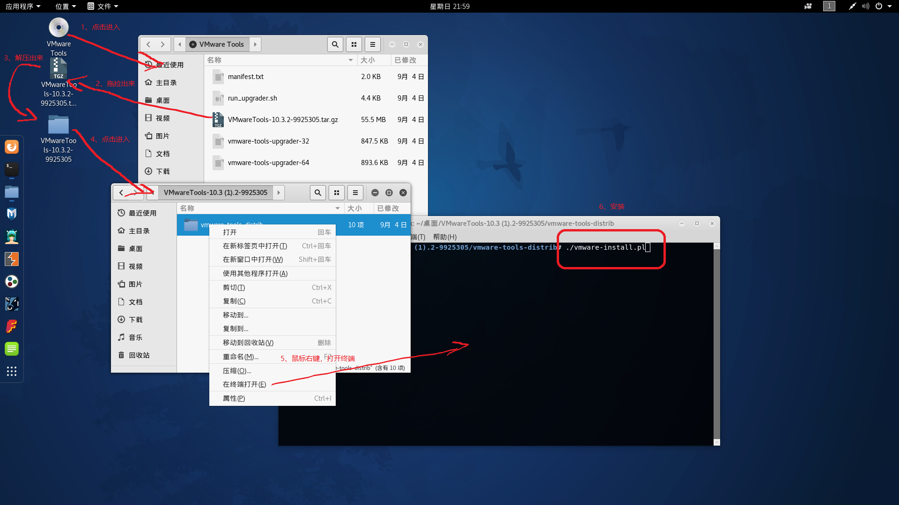
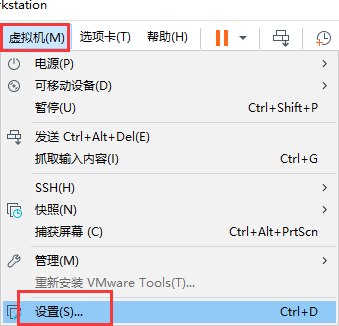
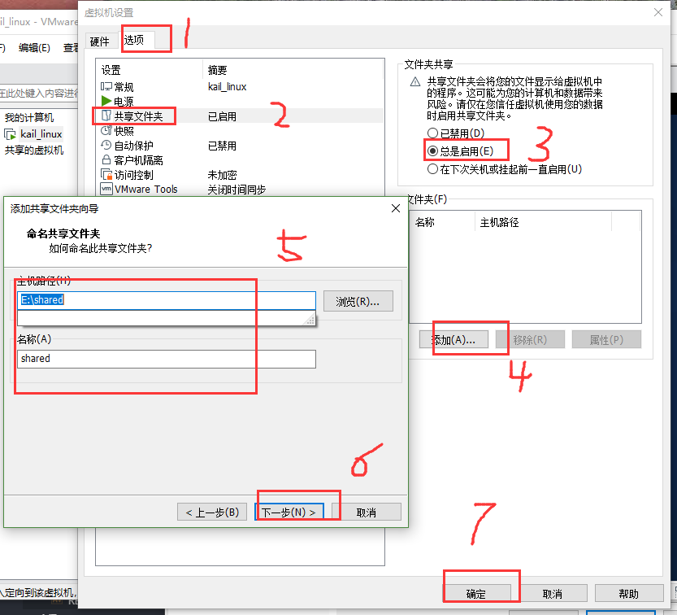

本页目录：
- 1、[下载安装VMware tool](#kail-linux-01)
- 2、[设置](#kail-linux-02)
- 3、[看效果](#kail-linux-03)

***

# <a name="kail-linux-01" href="#" >下载安装VMware tool</a>





```shell
./vmware-install.pl
```

>注意：一路都默认，都enter

# <a name="kail-linux-02" href="#" >设置</a>

>1、在win创建一个文件夹：shared

>2、配置虚拟机






# <a name="kail-linux-03" href="#" >看效果</a>

