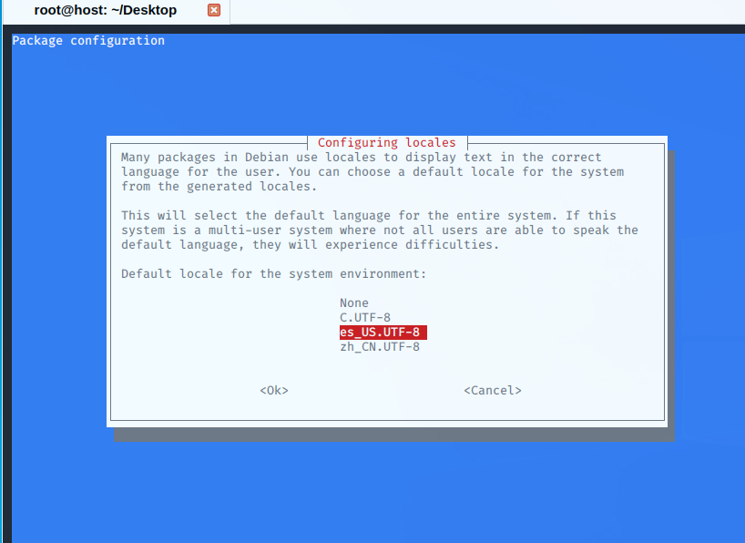

总操作流程：
- 1、[选择语言](#kail-linux-01)
- 2、[安装文字](#kail-linux-02)
- 3、[看效果](#kail-linux-03)

***

# <a name="kail-linux-01" href="#" >选择语言</a>

```shell
dpkg-reconfigure locales
```

- 进入图形界面，选中en_US.UTF-8 UTF-8和zh_CN.UTF-8 UTF-8（空格是选择，tab是切换，*是选中）并将zh_US.UTF-8选为默认



# <a name="kail-linux-02" href="#" >安装文字</a>

```
apt-get install xfonts-intl-chinese ttf-wqy-microhei ttf-wqy-zenhei xfonts-wqy

# win10 模式
kali-undercover

reboot
```

# <a name="kail-linux-03" href="#" >看效果</a>
