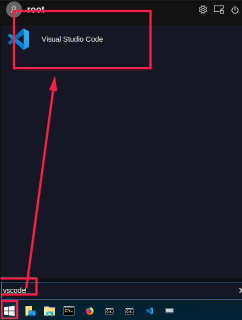

总操作流程：
- 1、[下载](#kail-linux-01)
- 2、[安装](#kail-linux-02)
- 3、[查看](#kail-linux-03)

***

# <a name="kail-linux-01" href="#" >下载</a>
[](https://code.visualstudio.com/Download)

# <a name="kail-linux-02" href="#" >安装</a>

```shell
dpkg -i code_*_amd64.deb
```
# <a name="kail-linux-03" href="#" >查看</a>

