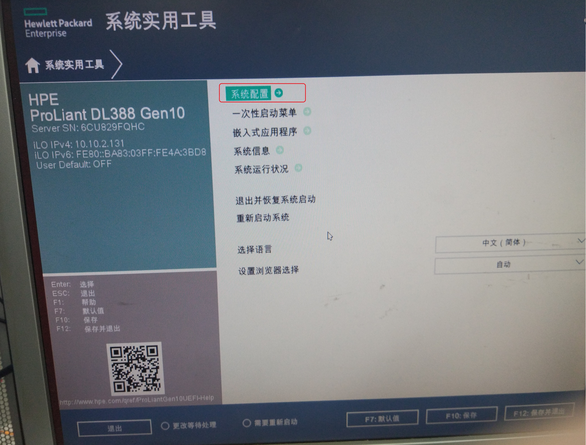
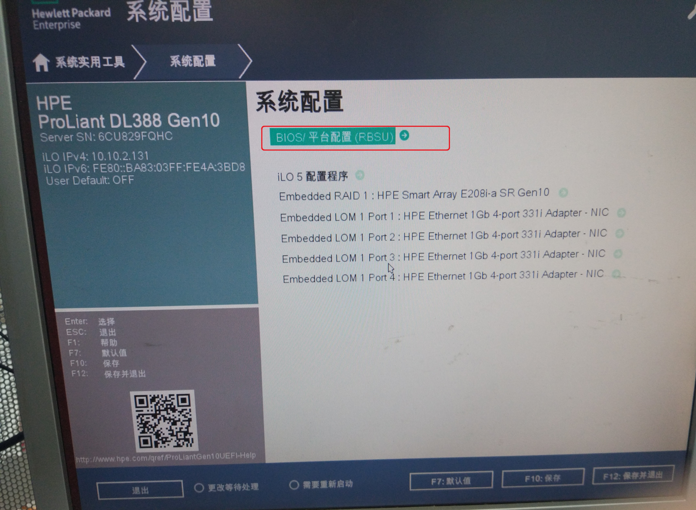
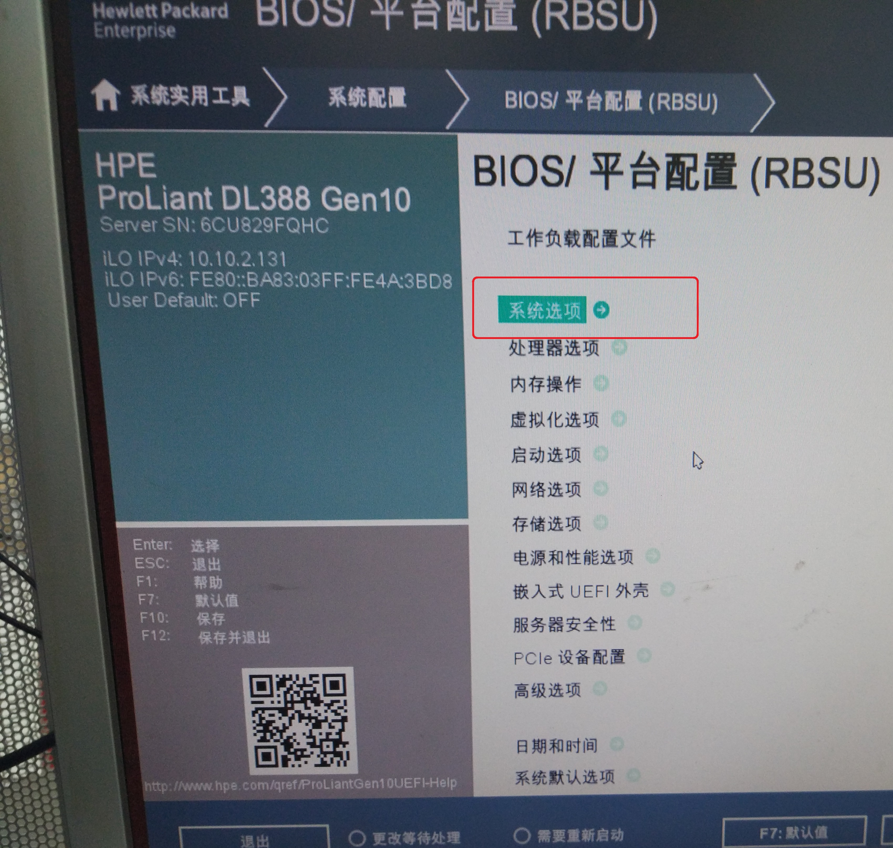
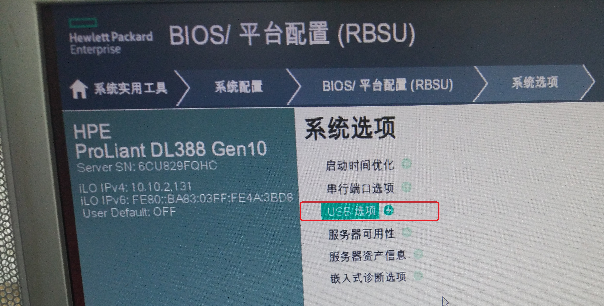
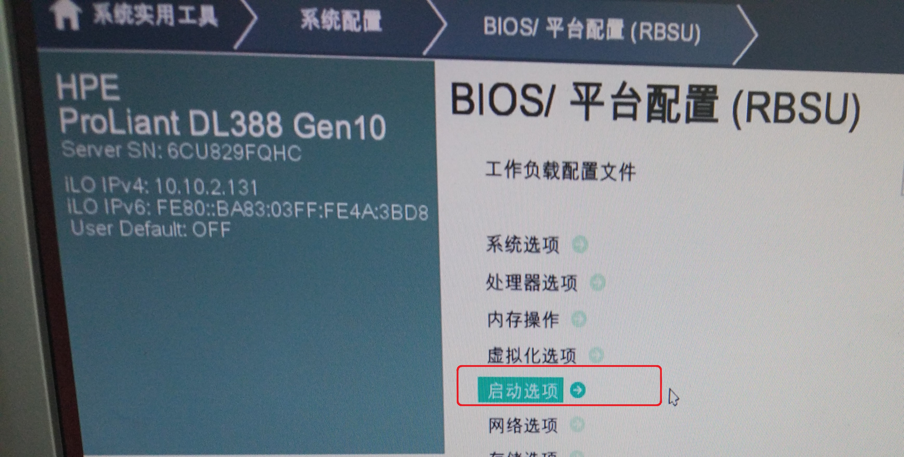
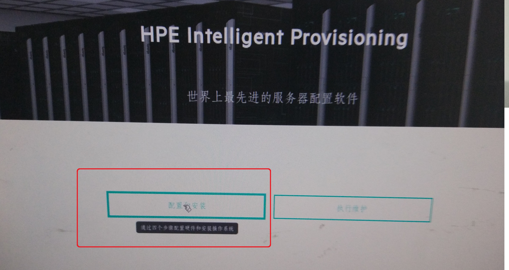
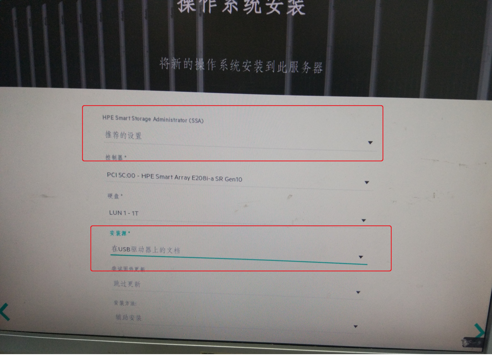
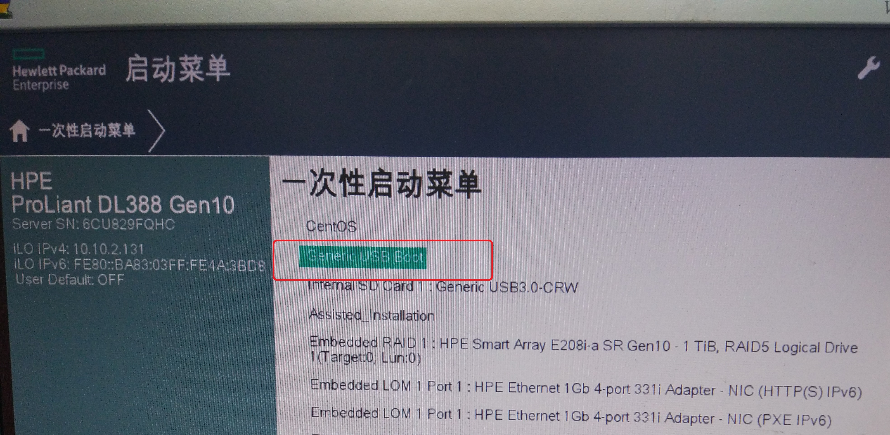

总操作流程：
- 1、[开启u盘启动](#Linux-01)
- 2、[设置安装源](#Linux-02)
- 3、[安装](#Linux-03)

***

# <a name="Linux-01" href="#" >开启u盘启动</a>

# <a name="Linux-02" href="#" >设置安装源</a>

> u盘要制作好

# <a name="Linux-03" href="#" >安装</a>

