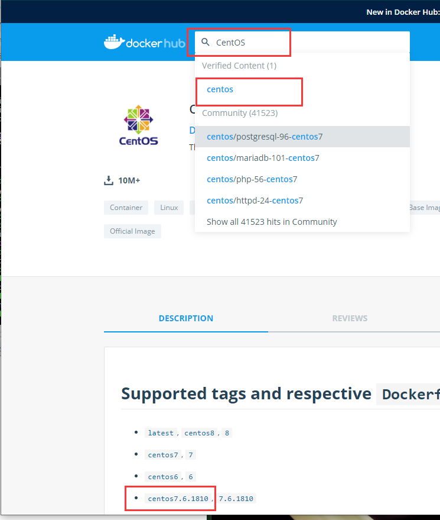

总操作流程：
- 1、[找镜像](#docker-01)
- 2、[下拉](#docker-02)
- 3、[测试](#docker-03)

***


# <a name="docker-01" href="#" >找镜像</a>

> 登录

https://hub.docker.com/

> 找镜像



# <a name="docker-02" href="#" >下拉</a>

```shel
docker pull centos:7.6.1810
```

# <a name="docker-03" href="#" >测试</a>

> 1、切换到centos:7.6.1810容器里

```
docker run -i -t centos:7.6.1810 /bin/bash
```

> 2、退出容器回到docker

```
exit
```

- <kbd>Ctrl</kbd>+<kbd>D</kbd>快捷键方式