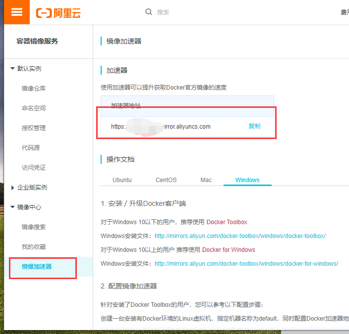

总操作流程：
- 1、获取加速连接
- 2、配置
- 3、测试

***

# 获取加速连接

[](https://cr.console.aliyun.com/cn-hangzhou/instances/mirrors)




# 配置

> 修改配置

```shell
vim  /etc/docker/daemon.json
```

```json
{"registry-mirrors":["https://v76w7ugm.mirror.aliyuncs.com"]}
```

> 2、重启服务

```shell
systemctl daemon-reload
systemctl restart docker
```
# 测试

> 下拉镜像

```shell
docker pull centos:7.6.1810
```

> 查看镜像

```shell
docker images
```