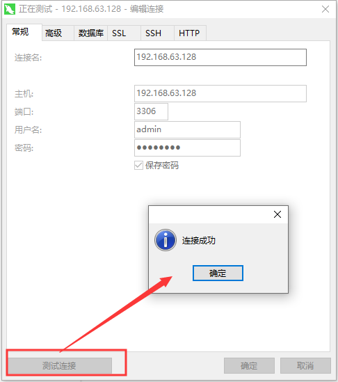

总操作流程：
- 1、拉取
- 2、配置
- 3、测试

***

# 拉取

```shell
docker pull mysql:8.0.18
```

# 配置

> 1、运行mysql

```
docker run --name mysql -p 3306:3306 -e MYSQL_ROOT_PASSWORD=123456 -d mysql:8.0.18
```
- -d 标识是让 docker 容器在后台运行。
- -p 标识通知 Docker 将容器内部使用的网络端口映射到我们使用的主机上。3306:3306 将容器的3306端口映射到本机的3306端口。
- –name 定义一个容器的名字，如果在执行docker run时没有指定Name，那么deamon会自动生成一个随机数字符串当做UUID。
- -e 设置环境变量，或者覆盖已存在的环境变量

> 2、加入防火墙

```
firewall-cmd --permanent --zone=public --add-port=3306/tcp
firewall-cmd --reload
firewall-cmd --zone=public --query-port=3306/tcp #查看添加端口是否成功
```

> 3、创建一个远程用户，并赋予权限，最后修改加密规则

```shell
# 查看运行的容器
docker ps 

# 进入容器中
docker exec -it 容器ID /bin/bash  

# 连接mysql
mysql -u root -p
```

```shell
mysql> CREATE USER 'admin'@'%' IDENTIFIED BY '123456';
mysql> flush privileges;
mysql> create database eladmin;
mysql> GRANT all privileges ON eladmin.* TO 'admin'@'%' WITH GRANT OPTION;
mysql> flush privileges; 
# 修改加密规则
mysql> ALTER USER 'admin'@'%' IDENTIFIED BY '123456' PASSWORD EXPIRE NEVER;
#更新一下用户的密码 
mysql> ALTER USER 'admin'@'%' IDENTIFIED WITH mysql_native_password BY '123456';
#刷新权限 
mysql> FLUSH PRIVILEGES;
#再重置下密码
mysql> alter user 'admin'@'%' identified by '123456';
mysql> FLUSH PRIVILEGES;
mysql> quit;
```

# 测试



