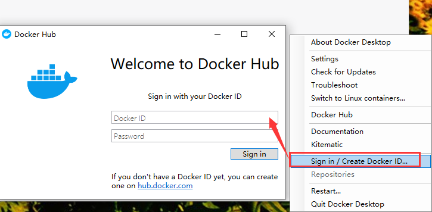
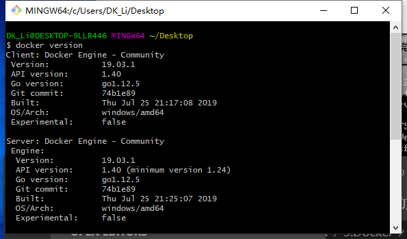

总操作流程：
- 1、[下载安装](#docker-01)
- 2、[配置](#docker-02)
- 3、[测试](#docker-03)

***

# <a name="docker-01" href="#" >下载安装 </a>

> Docker Desktop for Windows

[](https://docs.docker.com/v17.09/docker-for-windows/install/)


# <a name="docker-02" href="#" >配置</a>

> 1、注册

[](https://hub.docker.com/signup?next=%2F%3Fref%3Dlogin)

> 2、登录




# <a name="docker-03" href="#" >测试</a>

```
# 在可以使用shell命令的地方输入
docker version
```

