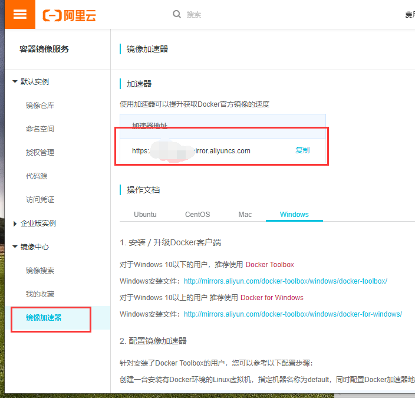
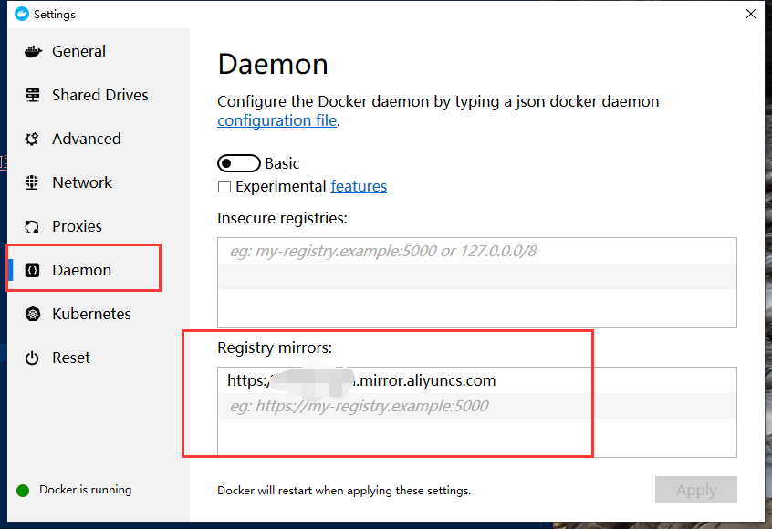

总操作流程：
- 1、[获取加速器地址](#docker-01)
- 2、[设置](#docker-02)
***

# <a name="docker-01" href="#" >获取加速器地址</a>

#### 阿里云

> 1、登录

> 2、获取加速器地址

### 中国官网

https://registry.docker-cn.com

### 腾讯云

https://mirror.ccs.tencentyun.com

# <a name="docker-02" href="#" >设置</a>

