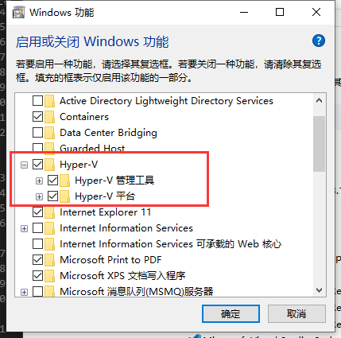
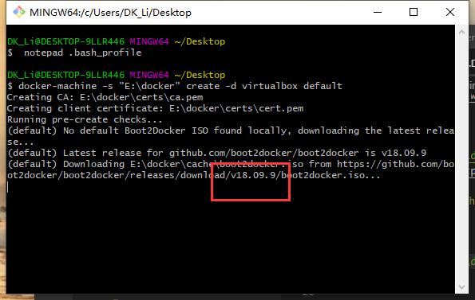
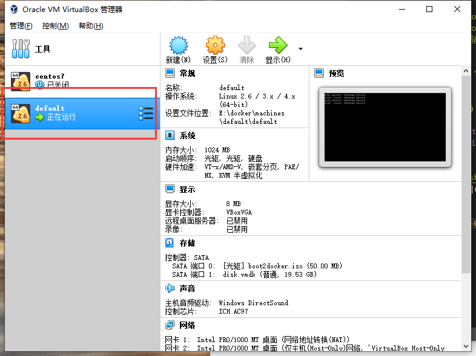

总操作流程：
- 1、[下载](#docker-01)
- 2、[安装配置](#docker-02)
- 3、[看效果](#docker-03)

***

# <a name="docker-01" href="#" >下载 </a>

> docker toolbox

[](http://mirrors.aliyun.com/docker-toolbox/windows/docker-toolbox/)

> Virtualbox

[](https://www.virtualbox.org/wiki/Downloads)


> Docker Desktop for Windows

[](https://docs.docker.com/v17.09/docker-for-windows/install/)


# <a name="docker-02" href="#" >安装配置</a>

> 配置环境



```shell
#以管理员方式打开cmd,Hyepr-v禁用
bcdedit /set hypervisorlaunchtype off
```

重启电脑

- 开启命令

```shell
bcdedit /set hypervisorlaunchtype auto 
```

重启电脑

> 配置虚拟机存放路径

- 打开Git Bash 输入命令配置.bash_profile 文件

```shell
 # 创建配置文件
 notepad .bash_profile
```

```shell
# 输入内容
export MACHINE_STORAGE_PATH='E:\docker'
```

> 安装

- 1、安装docker toolbox
- 2、删除docker toolbox安装后自动安装的Virtualbox后，安装下载的Virtualbox
- 3、打开Git Bash 输入命令创建虚拟机

```shell
docker-machine -s "E:\docker" create -d virtualbox default 
```



>要是下载忙，就到github下载iso文件放到D:\docker\cache文件夹下，删掉除了cache文件夹外的，重新打开Git Bash 输入命令创建虚拟机的命令


[](https://github.com/boot2docker/boot2docker/releases)

- 4、安装Docker Desktop for Windows


# <a name="docker-03" href="#" >看效果</a>



> 1、cmd输入命令

```
docker version

docker run hello-world
```