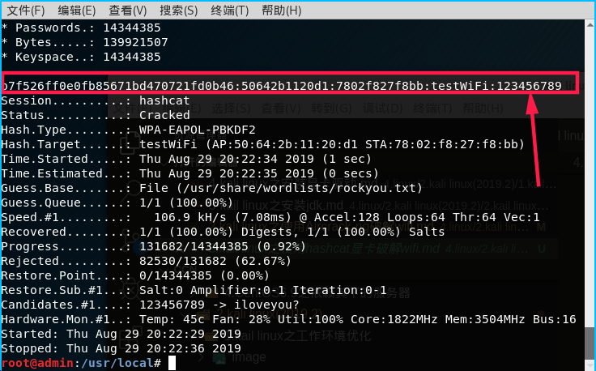

总操作流程：
- 1、[下载安装](#kail-linux-01)
- 2、[格式转化](#kail-linux-02)
- 3、[破解](#kail-linux-03)

--------

# <a name="kail-linux-01" href="#" >下载安装</a>

> 1、hashcat的安装（5.1.0版本的）

[](https://pan.baidu.com/s/18o2Q4K6aqmszl5BjpSF6Bg)

秘钥：igik


```
# 卸载自带的
apt-get remove hashcat

cd /usr/local
wget https://hashcat.net/files/hashcat-5.1.0.7z
7z x hashcat-5.1.0.7z
mv hashcat-5.1.0 hashcat
chmod 0777 /usr/local/hashcat
vim /etc/profile
```

```
#set hashcat environment
HASHCAT_HOME=/usr/local/hashcat
PATH=$PATH:$HASHCAT_HOME/bin
export HASHCAT_HOME PATH
```

```
source /etc/profile 
sudo update-alternatives --install "/usr/bin/hashcat" "hashcat" "/usr/local/hashcat/hashcat64.bin" 1
sudo update-alternatives --set hashcat /usr/local/hashcat/hashcat64.bin
hashcat -V
```

> 2、hashcat-utils的安装（转化工具）

[](https://pan.baidu.com/s/1GrHNAJNsWodTwQKogHwPRg)

秘钥：297s

```
cd /usr/local
wget https://github.com/hashcat/hashcat-utils/archive/master.zip

unzip master.zip
cd hashcat-utils-master/src
make
```

# <a name="kail-linux-02" href="#" >格式转化</a>

```
# wpa2-01.cap是抓到的包，out.hccapx是转化的格式


/usr/local/hashcat-utils-master/src/cap2hccapx.bin /usr/local/wpa2-01.cap /usr/local/out.hccapx
```

# <a name="kail-linux-03" href="#" >破解</a>

```
# out.hccap是转化好的包，rockyou.txt是字典
hashcat -m 2500 -a 0 /usr/local/out.hccapx  /usr/share/wordlists/rockyou.txt --status
```

- a    （–attack-mode=NUM）          #破解模式，下面也有列表
        - 0 = Straight   （字典破解）
        - 1  = Combination  （组合破解）
        - 2 = Toggle-Case
        - 3 = Brute-force  （掩码暴力破解）
        - 4 = Permutation   （组合破解）
        - 5 = Table-Lookup

>  破解成功标志



- hashcat.potfile文件可以查看已经破解的密码

```
cat /usr/local/hashcat/hashcat.potfile
```


