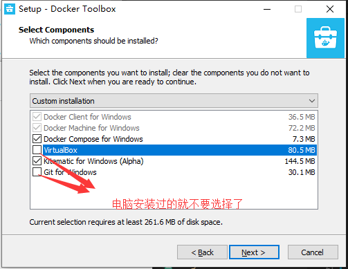
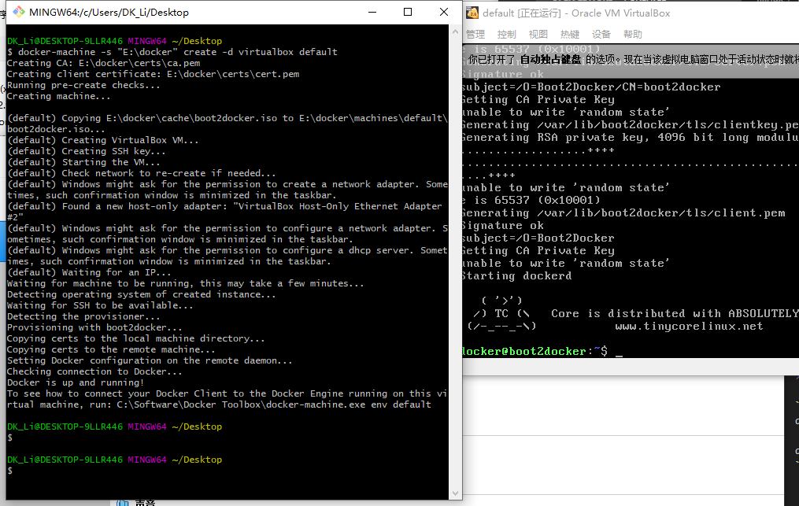

总操作流程：
- 1、[下载](#docker-01)
- 2、[安装配置](#docker-02)
- 3、[测试](#docker-03)

***

# <a name="docker-01" href="#" >下载 </a>

> docker toolbox

[](http://mirrors.aliyun.com/docker-toolbox/windows/docker-toolbox/)

> VirtualBox

[](https://www.virtualbox.org/wiki/Downloads)


# <a name="docker-02" href="#" >安装配置</a>

> 配置环境


```shell
#以管理员方式打开cmd,Hyepr-v禁用
bcdedit /set hypervisorlaunchtype off
```

重启电脑

- 开启命令

```shell
bcdedit /set hypervisorlaunchtype auto 
```

重启电脑

> 配置虚拟机存放路径

- 打开cmd输入命令

```shell
 notepad .bash_profile
```

```shell
# 输入内容
export MACHINE_STORAGE_PATH='E:\docker'
```

> 安装

- 1、安装VirtualBox
- 2、安装docker toolbox



- 3、打开cmd输入命令创建虚拟机

```shell
docker-machine -s "E:\docker" create -d virtualbox default 
```


>要是下载慢，就到github下载提示的boot2docker.iso对应版本文件放到D:\docker\cache文件夹下

[](https://github.com/boot2docker/boot2docker/releases)




# <a name="docker-03" href="#" >测试</a>

> 1、使用ssh远程登录

```
账号：docker
密码：tcuser
```

> 2、测试

```
docker version
```