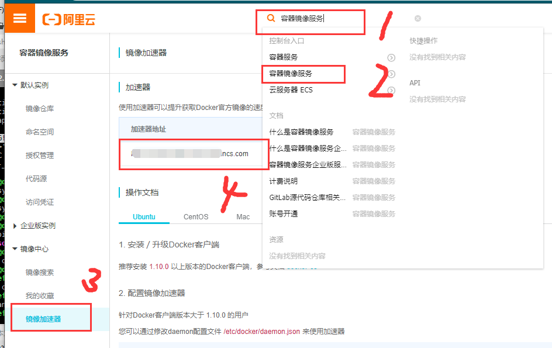

总操作流程：
- 1、[运行应用程序](#docker-01)
- 2、[切换到容器](#docker-02)
- 3、[启动容器（后台模式）](#docker-03)

***

# <a name="docker-01" href="#" >运行应用程序</a>

```shell
/bin/echo "Hello world"

# 运行的镜像ubuntu:15.10的"Hello world"
docker run ubuntu:15.10 /bin/echo "Hello world"
```



# <a name="docker-02" href="#" >切换到容器</a>

```shell

# 切换到ubuntu15.10系统
docker run -i -t ubuntu:15.10 /bin/bash

/bin/echo "Hello world"
```

- 运行exit命令或者使用CTRL+D来退出容器

# <a name="docker-03" href="#" >启动容器（后台模式）</a>

```shell
# 以进程方式运行的容器
docker run -d ubuntu:15.10 /bin/sh -c "while true; do echo hello world; sleep 1; done"

# 查看容器是否运行
docker ps

# 查看容器内的标准输出
docker logs +[CONTAINER ID]
或者
docker logs +[NAMES]

# 停止容器
docker stop +[NAMES]
```