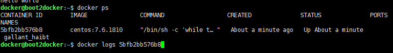

# 创建文件

```
sudo -i 

vi /etc/docker/daemon.json
```

```
{
        try-mirrors": ["https://mirror.ccs.tencentyun.com"]
}
```

- 腾讯云的服务器：https://mirror.ccs.tencentyun.com
- 阿里云的服务：https://xxxxx.mirror.aliyuncs.com



```
reboot
```

