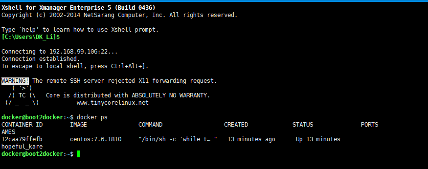

总操纵流程：
- 1、[进入容器](#docker-01)
- 2、[测试](#docker-02)

***

# <a name="docker-01" href="#" >1、进入容器</a>

> 1、查看运行的容器

```
docker ps
```



> 2、进入容器中

```
docker exec -it 12caa79ffefb /bin/bash  
```

# <a name="docker-02" href="#" >2、测试</a>

- 更新

```
yum -y update
```
