总操作流程：
- 1、[物理主机安装](#linux-01)
    - 1.1、[下载系统](#linux-01-01)
    - 1.2、[刻录系统到u盘](#linux-01-02)
    - 1.3、[安装系统](#linux-01-03)
    - 1.4、[配置ip地址](#linux-01-04)
- 2、[虚拟机安装](#linux-02)
    - 2.1、[下载安装虚拟机教程](#linux-02-01)
    - 2.2、[在虚拟机上安装linux系统的教程](#linux-02-02)


***

# <a name="Linux-01" href="#" >物理主机安装</a>

### <a name="Linux-01-01" href="#" >下载系统 (centos6)</a>

[](https://www.centos.org/)

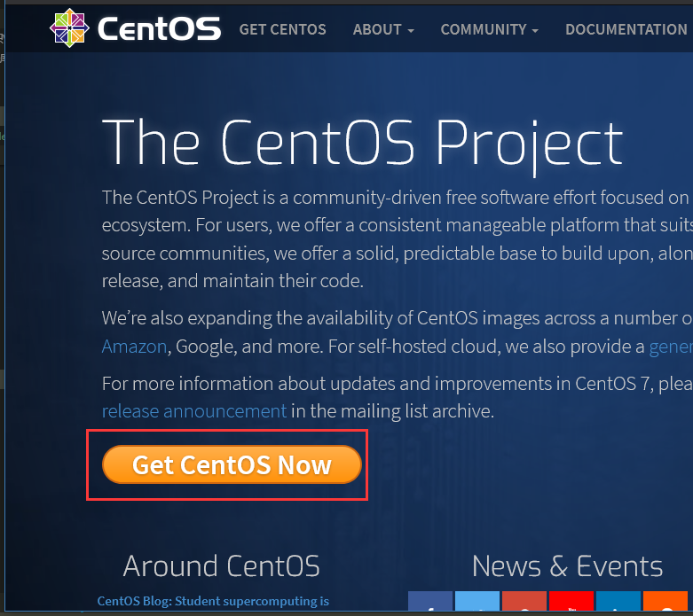

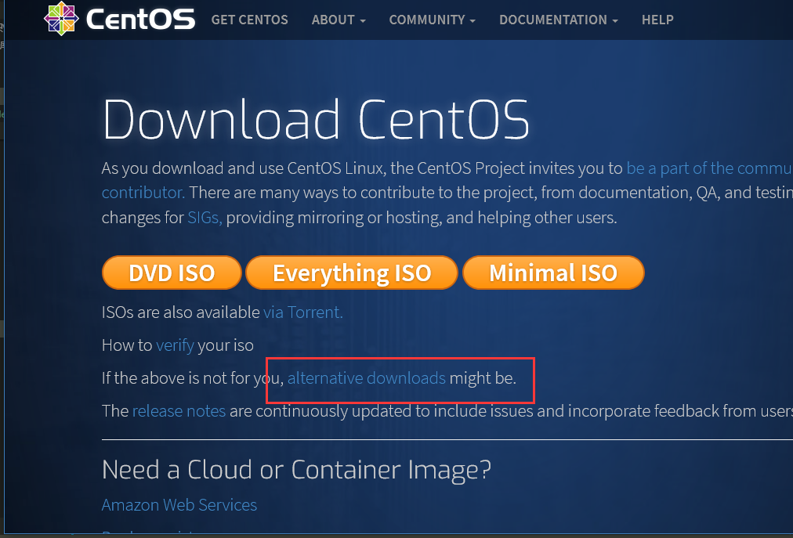

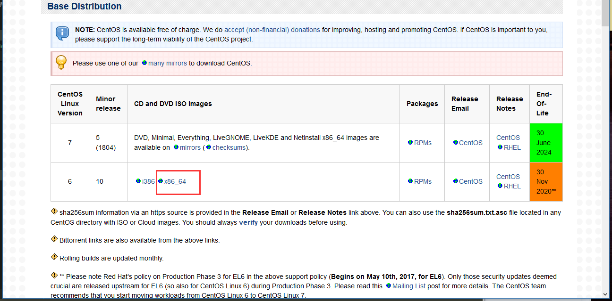

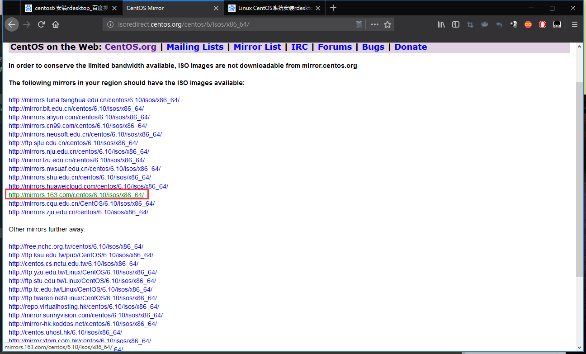

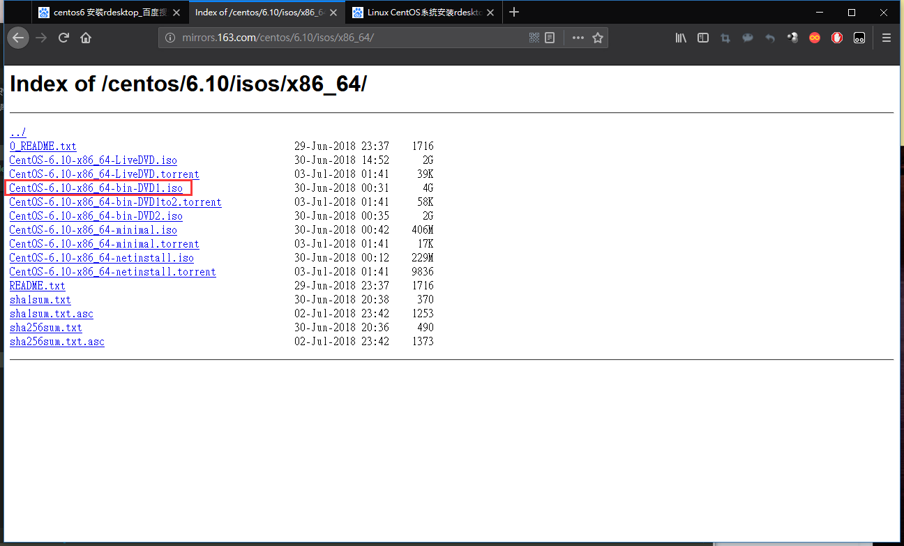


### <a name="Linux-01-02" href="#" >刻录系统到u盘</a>

[](https://sourceforge.net/projects/win32diskimager/files/latest/download)


### <a name="Linux-01-03" href="#" >安装系统</a>

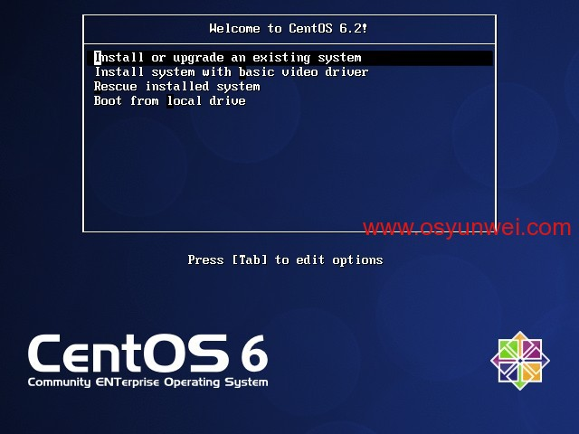

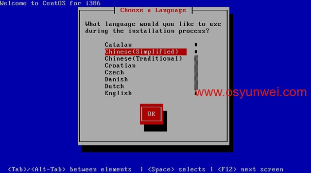

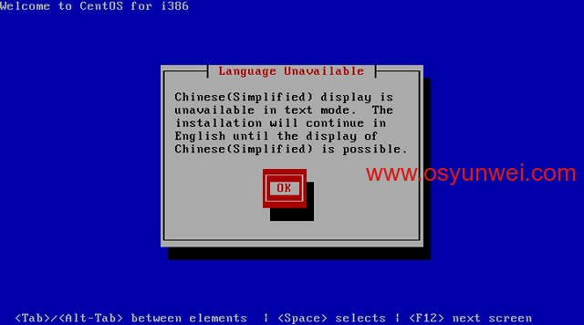

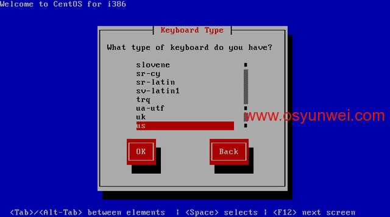

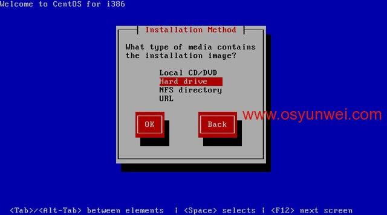

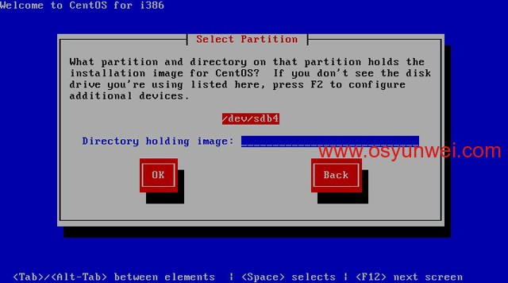

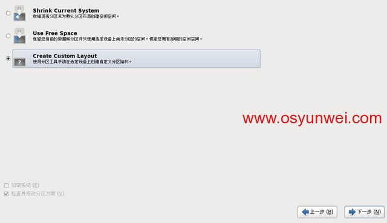

> 选择自定义分区

- 第一个分区
```
文件系统类型：选择swap

允许的驱动器：只勾选sda前面的复选框

大小：1024(一般为内存大小的2倍)

其它大小选项：固定大小
```

- 第二个分区
```
挂载点： /

文件系统类型：ext4

允许的驱动器：只勾选sda前面的复选框

大小：默认

其它大小选项：使用全部可用空间
```

### <a name="Linux-04" href="#" >配置ip地址</a>


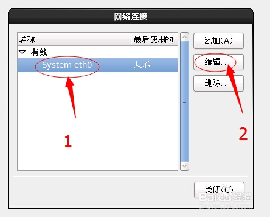

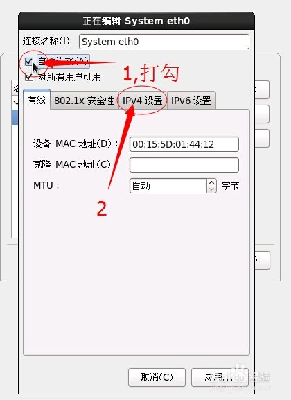

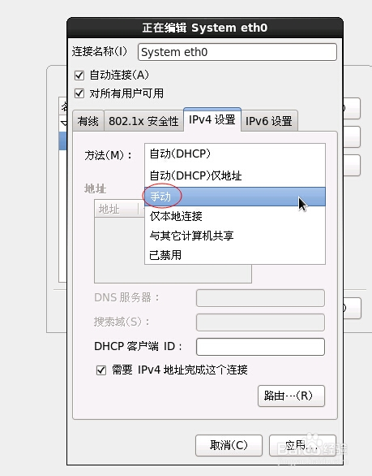

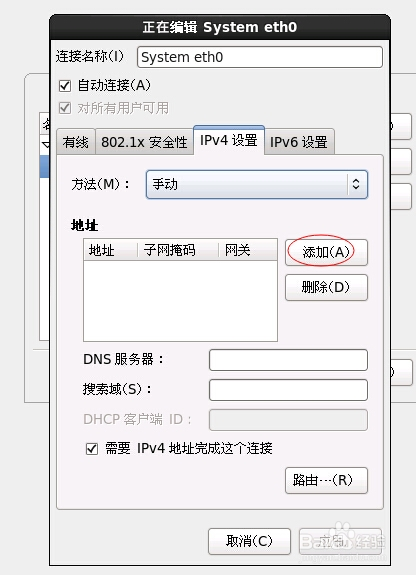

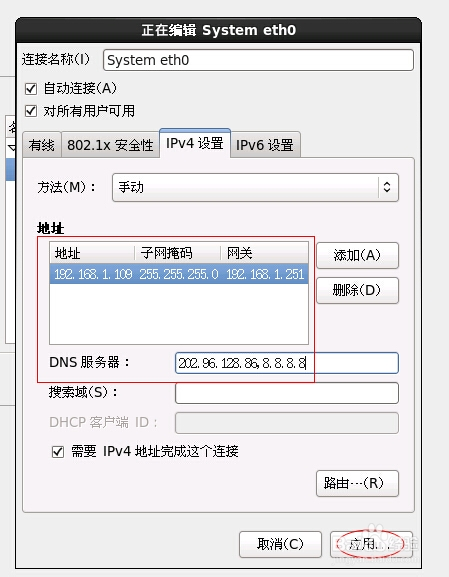

# <a name="Linux-02" href="#" >虚拟机安装</a>
### <a name="Linux-02-01" href="#" >下载安装虚拟机教程</a>

[](http://www.vmware.com/products/workstation/)


百度找秘钥


### <a name="Linux-02-02" href="#" >在虚拟机上安装linux系统的教程</a>

[](http://jingyan.baidu.com/article/a948d651484fba0a2dcd2e15.html)

`注：主机安装的话用记事本打开这个文件syslinux\syslinux.cfg，把第一行 default vesamenu.c32 替换为default linux timeout 600 label linux kernel vmlinuz append initrd=initrd.img这样修改之后`

