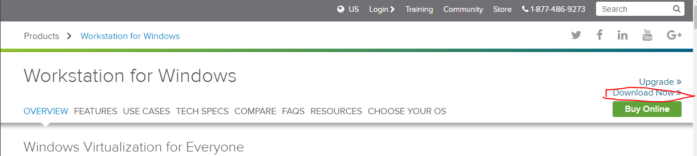

总操作流程：
- 1、下载系统；
- 2、刻录系统到u盘（下载刻录工具）；
- 3、安装系统；

----------

# 电脑安装linux
下载原版Linux CentOS-6.9版教程：http://jingyan.baidu.com/article/6dad5075cd4e6ca123e36e31.html

将Linux系统刻录到u盘里的教程：http://www.xitongzhijia.net/xtjc/20140721/24235.html
UltraISO PE（软碟通）软件--要以管理员身份运行：http://pan.baidu.com/s/1eRJj1vG

安装Linux系统教程：http://www.osyunwei.com/archives/2307.html

----------

# 虚拟机安装linux
总操作流程：
### 1、下载安装虚拟机；
### 2、下载linux系统；
### 3、将linux系统安装到虚拟机上；

----------
- 下载安装虚拟机教程
[下载地址](http://www.vmware.com/products/workstation/)

百度找秘钥

- 下载linux系统教程
http://jingyan.baidu.com/article/6dad5075cd4e6ca123e36e31.html

- 在虚拟机上安装linux系统的教程
http://jingyan.baidu.com/article/a948d651484fba0a2dcd2e15.html

`注：主机安装的话用记事本打开这个文件syslinux\syslinux.cfg，把第一行 default vesamenu.c32 替换为default linux timeout 600 label linux kernel vmlinuz append initrd=initrd.img这样修改之后`

